## Synopsis


Possumwood (named after [Sandbox Tree](https://en.wikipedia.org/wiki/Hura_crepitans)) is a **graph-based procedural sandbox**, implementing concepts of graph-based [visual programming](https://en.wikipedia.org/wiki/Visual_programming_language) in a simple interface. It is intended to provide a user-friendly and accessible UI for experimenting with common computer graphics algorithms and libraries (e.g., [OpenGL](https://www.opengl.org/), [CGAL](http://www.cgal.org/), [WildMagic](https://www.geometrictools.com/), [OpenCV](http://opencv.org/)).

Possumwood is built on top of a simple graph-evaluation engine and a Qt-based node graph editor, with an OpenGL viewport. Its main strength is its extensibility - it is trivial to implement new plugins supporting new libraries and data types, which allows free and user-friendly experimentation with parameters of each algorithm.

**Possumwood is a sandbox, not a production tool.** As a sandbox, it is quite open to radical changes and redesign, and for the time being it does not guarantee any form of backwards compatibility.

[](https://travis-ci.org/martin-pr/possumwood) [](https://build.snapcraft.io/user/martin-pr/possumwood) [](https://www.codacy.com/app/martin.prazak/possumwood?utm_source=github.com&amp;utm_medium=referral&amp;utm_content=martin-pr/possumwood&amp;utm_campaign=Badge_Grade)

## Table of contents
- [Synopsis](#synopsis)
- [Example setups](#example-setups)
  - [Opengl](#opengl)
  - [Polymesh](#polymesh)
  - [Image](#image)
  - [Lua](#lua)
  - [Animation](#animation)
  - [Opencv](#opencv)
  - [Hdr](#hdr)
  - [Lightfields](#lightfields)
- [Tutorials](#tutorials)
  - [Basics](#basics)
  - [OpenGL / GLSL](#opengl--glsl)
  - [Image manipulation](#image-manipulation)
- [Installation](#installation)
  - [Launchpad PPA for Ubuntu 18.04+](#launchpad-ppa-for-ubuntu-1804)
  - [Installation using Snap](#installation-using-snap)
  - [Building from source](#building-from-source)
- [Code Example](#code-example)
- [API Reference](#api-reference)
- [Contributors](#contributors)
- [License](#license)

## Example setups
Possumwood comes with a number of example setups that can serve as a starting point for experimentation.

### Opengl
<table> 
<tr> 
<td>
<div style="width:290px">&nbsp;&nbsp;&nbsp;&nbsp;&nbsp;&nbsp;&nbsp;&nbsp;&nbsp;&nbsp;&nbsp;&nbsp;&nbsp;</div> 
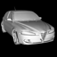
<div style="width:290px">&nbsp;&nbsp;&nbsp;&nbsp;&nbsp;&nbsp;&nbsp;&nbsp;&nbsp;&nbsp;&nbsp;&nbsp;&nbsp;</div> 
</td>
<td> 

#### A simple OpenGL demo

A simple demo showing how to load an `.obj` file (positions, normals and topology) and display it using OpenGL. 

Named vertex attributes _p_ and _n_ are loaded from an `.obj` file, and passed through to an OpenGL vertex/fragment shader setup. In later demos, this setup is wrapped-up in a subnetwork.

</td> 
<td>
<div style="width:290px">&nbsp;&nbsp;&nbsp;&nbsp;&nbsp;&nbsp;&nbsp;&nbsp;&nbsp;&nbsp;&nbsp;&nbsp;&nbsp;</div> 
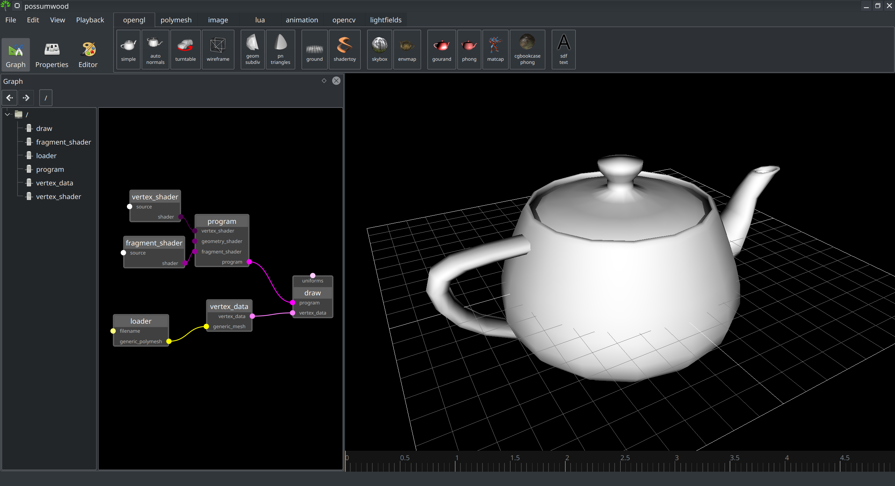
<div style="width:290px">&nbsp;&nbsp;&nbsp;&nbsp;&nbsp;&nbsp;&nbsp;&nbsp;&nbsp;&nbsp;&nbsp;&nbsp;&nbsp;</div> 
</td>
</tr> 
<tr> 
<td>
<div style="width:290px">&nbsp;&nbsp;&nbsp;&nbsp;&nbsp;&nbsp;&nbsp;&nbsp;&nbsp;&nbsp;&nbsp;&nbsp;&nbsp;</div> 

<div style="width:290px">&nbsp;&nbsp;&nbsp;&nbsp;&nbsp;&nbsp;&nbsp;&nbsp;&nbsp;&nbsp;&nbsp;&nbsp;&nbsp;</div> 
</td>
<td> 

#### Automatic normals

When an mesh file doesn't include explicit normals, it is relatively easy to use a fragment shader to "autogenerate" normals using screen-space derivatives `dFdx()` and `dFdy()`. This demo shows how to do that in Possumwood - just have a look at `fragment_shared` source.
</td> 
<td>
<div style="width:290px">&nbsp;&nbsp;&nbsp;&nbsp;&nbsp;&nbsp;&nbsp;&nbsp;&nbsp;&nbsp;&nbsp;&nbsp;&nbsp;</div> 
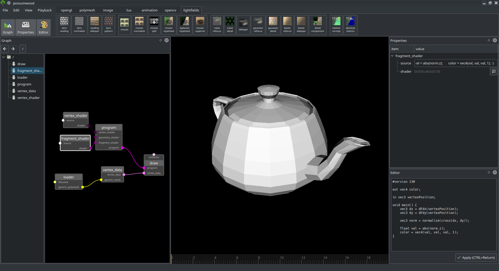
<div style="width:290px">&nbsp;&nbsp;&nbsp;&nbsp;&nbsp;&nbsp;&nbsp;&nbsp;&nbsp;&nbsp;&nbsp;&nbsp;&nbsp;</div> 
</td>
</tr> 
<tr> 
<td>
<div style="width:290px">&nbsp;&nbsp;&nbsp;&nbsp;&nbsp;&nbsp;&nbsp;&nbsp;&nbsp;&nbsp;&nbsp;&nbsp;&nbsp;</div> 
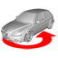
<div style="width:290px">&nbsp;&nbsp;&nbsp;&nbsp;&nbsp;&nbsp;&nbsp;&nbsp;&nbsp;&nbsp;&nbsp;&nbsp;&nbsp;</div> 
</td>
<td> 

#### Turntable demo

A simple shader setup passing a time value (i.e., the timeline value) as a uniform into the shader (together with viewport parameters). This value is then converted in the `vertex_shader` to a transformation matrix used to rotate a model.
</td> 
<td>
<div style="width:290px">&nbsp;&nbsp;&nbsp;&nbsp;&nbsp;&nbsp;&nbsp;&nbsp;&nbsp;&nbsp;&nbsp;&nbsp;&nbsp;</div> 
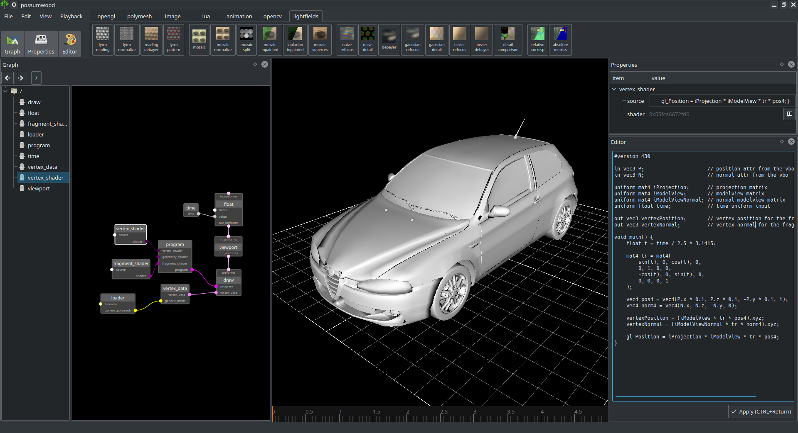
<div style="width:290px">&nbsp;&nbsp;&nbsp;&nbsp;&nbsp;&nbsp;&nbsp;&nbsp;&nbsp;&nbsp;&nbsp;&nbsp;&nbsp;</div> 
</td>
</tr> 
<tr> 
<td>
<div style="width:290px">&nbsp;&nbsp;&nbsp;&nbsp;&nbsp;&nbsp;&nbsp;&nbsp;&nbsp;&nbsp;&nbsp;&nbsp;&nbsp;</div> 
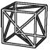
<div style="width:290px">&nbsp;&nbsp;&nbsp;&nbsp;&nbsp;&nbsp;&nbsp;&nbsp;&nbsp;&nbsp;&nbsp;&nbsp;&nbsp;</div> 
</td>
<td> 

#### Wireframe using a geometry shader

Wireframe mode is one of the rendering modes of OpenGL. A similar but more controllable effect can be achieved by processing a model using a geometry shader, which allows to convert primitives to a different number of primitives of the same or different type.

This setup shows how to emit a line for each polygon edge of the input geometry using a program in `geometry_shader`. It also shows how to adjust the line width to screen resolution, maintaining the width independent to view parameters.
</td> 
<td>
<div style="width:290px">&nbsp;&nbsp;&nbsp;&nbsp;&nbsp;&nbsp;&nbsp;&nbsp;&nbsp;&nbsp;&nbsp;&nbsp;&nbsp;</div> 

<div style="width:290px">&nbsp;&nbsp;&nbsp;&nbsp;&nbsp;&nbsp;&nbsp;&nbsp;&nbsp;&nbsp;&nbsp;&nbsp;&nbsp;</div> 
</td>
</tr> 
<tr> 
<td>
<div style="width:290px">&nbsp;&nbsp;&nbsp;&nbsp;&nbsp;&nbsp;&nbsp;&nbsp;&nbsp;&nbsp;&nbsp;&nbsp;&nbsp;</div> 
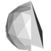
<div style="width:290px">&nbsp;&nbsp;&nbsp;&nbsp;&nbsp;&nbsp;&nbsp;&nbsp;&nbsp;&nbsp;&nbsp;&nbsp;&nbsp;</div> 
</td>
<td> 

#### Mesh subdivision in a geometry shader

While modern GPUs contain a bespoke functionality for subdivision, this simple demo shows how a similar (if limited) effect can be achieved using a simple geometry shader.

This demo implements a simple interpolative sudvision scheme with normal-based displacement. All subdivision computation is done in a geometry shader, with additional vertices and topology emitted by calling a recusive function. This approach is just a toy example, as it is strictly limited by the capabilities of individual GPUs - in practical applications, bespoke tesselation shaders perform much better.
</td> 
<td>
<div style="width:290px">&nbsp;&nbsp;&nbsp;&nbsp;&nbsp;&nbsp;&nbsp;&nbsp;&nbsp;&nbsp;&nbsp;&nbsp;&nbsp;</div> 
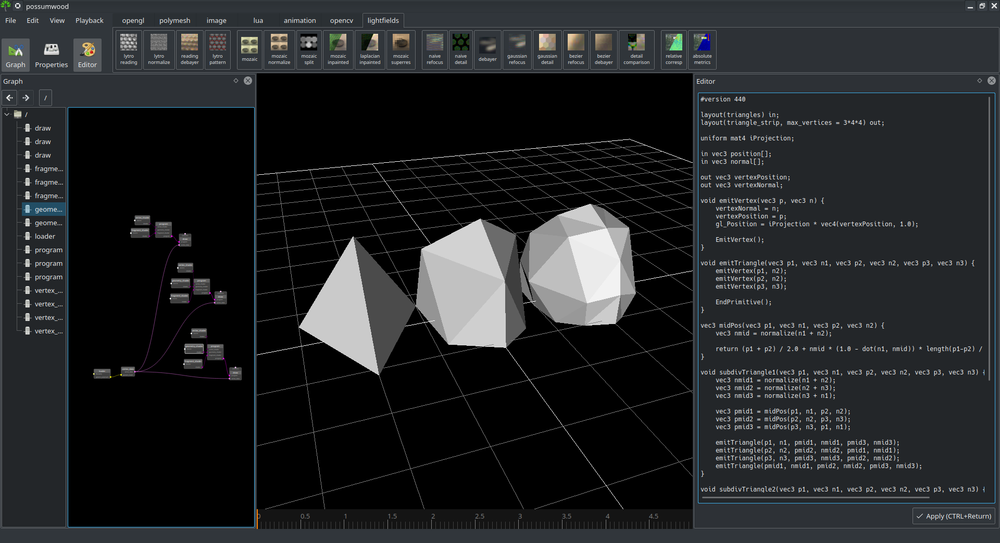
<div style="width:290px">&nbsp;&nbsp;&nbsp;&nbsp;&nbsp;&nbsp;&nbsp;&nbsp;&nbsp;&nbsp;&nbsp;&nbsp;&nbsp;</div> 
</td>
</tr> 
<tr> 
<td>
<div style="width:290px">&nbsp;&nbsp;&nbsp;&nbsp;&nbsp;&nbsp;&nbsp;&nbsp;&nbsp;&nbsp;&nbsp;&nbsp;&nbsp;</div> 
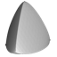
<div style="width:290px">&nbsp;&nbsp;&nbsp;&nbsp;&nbsp;&nbsp;&nbsp;&nbsp;&nbsp;&nbsp;&nbsp;&nbsp;&nbsp;</div> 
</td>
<td> 

#### PN Triangles in a geometry shader

Curved PN Triangles is a simple geometry subdivision scheme, replacing all triangles with a bezier patch directly on the GPU. The shape interpolation uses a cubic spline, and normals are interpolated using a quadratic spline to maintain continuity.

This implementation uses a geometry shader for emitting additional polygons.

<sub>Vlachos, Alex, et al. ["Curved PN triangles."](http://citeseerx.ist.psu.edu/viewdoc/download?doi=10.1.1.104.4338&rep=rep1&type=pdf) Proceedings of the 2001 symposium on Interactive 3D graphics. ACM, 2001.</sub>
</td> 
<td>
<div style="width:290px">&nbsp;&nbsp;&nbsp;&nbsp;&nbsp;&nbsp;&nbsp;&nbsp;&nbsp;&nbsp;&nbsp;&nbsp;&nbsp;</div> 
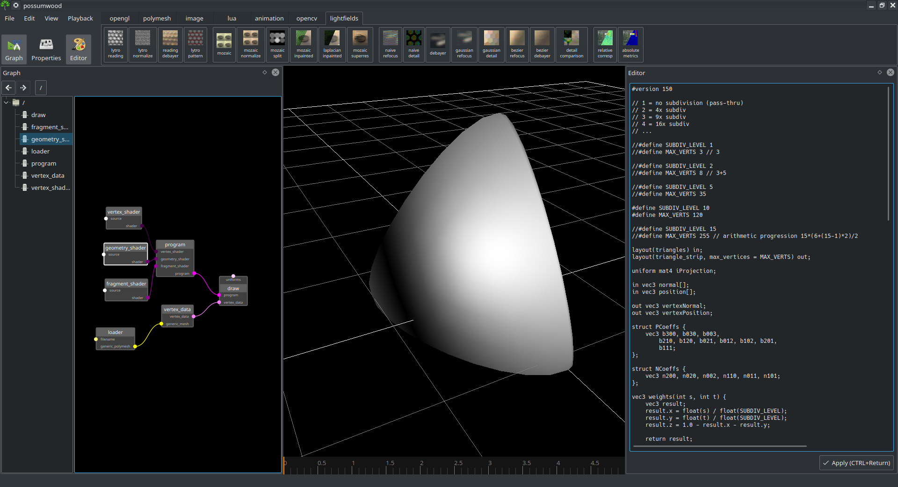
<div style="width:290px">&nbsp;&nbsp;&nbsp;&nbsp;&nbsp;&nbsp;&nbsp;&nbsp;&nbsp;&nbsp;&nbsp;&nbsp;&nbsp;</div> 
</td>
</tr> 
<tr> 
<td>
<div style="width:290px">&nbsp;&nbsp;&nbsp;&nbsp;&nbsp;&nbsp;&nbsp;&nbsp;&nbsp;&nbsp;&nbsp;&nbsp;&nbsp;</div> 

<div style="width:290px">&nbsp;&nbsp;&nbsp;&nbsp;&nbsp;&nbsp;&nbsp;&nbsp;&nbsp;&nbsp;&nbsp;&nbsp;&nbsp;</div> 
</td>
<td> 

#### Infinite ground plane

A simple way of generating procedural graphics using GLSL employs rendering a single polygon covering the whole frame, and a per-pixel fragment shader (with additional inputs) to compute the final colour. A number of examples of this approach can be found at [ShaderToy](https://www.shadertoy.com).

This demo is a simple example of such approach - based on a ray generated from a near and far plane point corresponding to a screen pixel, it computes the position of ray's intersection with the ground plane (`y==0`), and uses this information to synthesize an "infinite" ground plane covered in checkerboard, with a "spotlight". The fragment shader does all the computation - from ray intersection, through colour and checkerboard generation, to depth-value computation to allow the ground plane to composit correctly with other objects in a scene.
</td> 
<td>
<div style="width:290px">&nbsp;&nbsp;&nbsp;&nbsp;&nbsp;&nbsp;&nbsp;&nbsp;&nbsp;&nbsp;&nbsp;&nbsp;&nbsp;</div> 
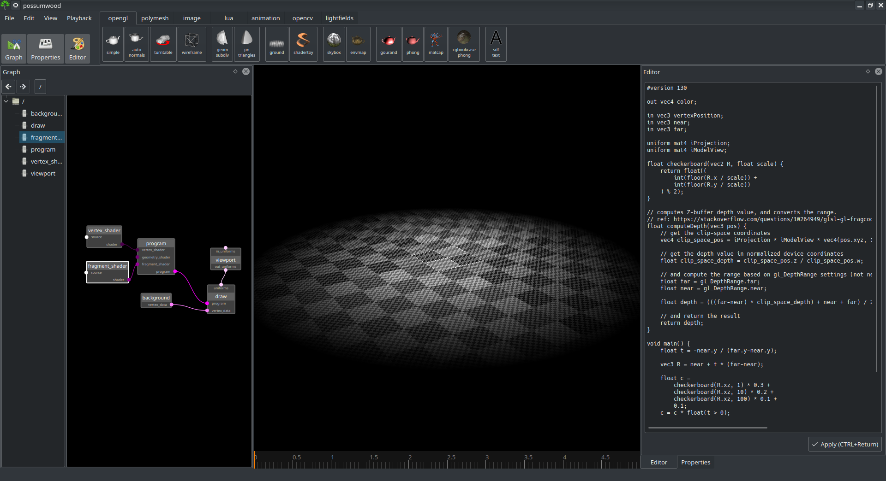
<div style="width:290px">&nbsp;&nbsp;&nbsp;&nbsp;&nbsp;&nbsp;&nbsp;&nbsp;&nbsp;&nbsp;&nbsp;&nbsp;&nbsp;</div> 
</td>
</tr> 
<tr> 
<td>
<div style="width:290px">&nbsp;&nbsp;&nbsp;&nbsp;&nbsp;&nbsp;&nbsp;&nbsp;&nbsp;&nbsp;&nbsp;&nbsp;&nbsp;</div> 

<div style="width:290px">&nbsp;&nbsp;&nbsp;&nbsp;&nbsp;&nbsp;&nbsp;&nbsp;&nbsp;&nbsp;&nbsp;&nbsp;&nbsp;</div> 
</td>
<td> 

#### Shadertoy

[ShaderToy](https://www.shadertoy.com) is a community of artists and programmers centered around generating interesting graphics content in GLSL using a single fragment shader.

One of the common techniques to generate procedural 3D content in a fragment shader is Raymarching - a simple method of tracing rays against shapes represented as Signed Distance Functions, and generating 3D content based on them.

This demo is a port of a [ShaderToy demo](https://www.shadertoy.com/view/Xds3zN) by [Indigo Quilezles](https://www.shadertoy.com/user/iq), showing different SDFs and a few additional effects that can be achieved by raymarching. A comprehensive raymarching tutorial can be found at the [RaymarchingWorkshop](https://github.com/ajweeks/RaymarchingWorkshop).
</td> 
<td>
<div style="width:290px">&nbsp;&nbsp;&nbsp;&nbsp;&nbsp;&nbsp;&nbsp;&nbsp;&nbsp;&nbsp;&nbsp;&nbsp;&nbsp;</div> 
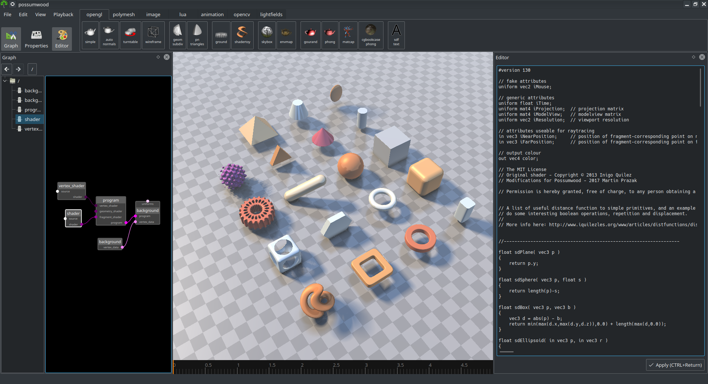
<div style="width:290px">&nbsp;&nbsp;&nbsp;&nbsp;&nbsp;&nbsp;&nbsp;&nbsp;&nbsp;&nbsp;&nbsp;&nbsp;&nbsp;</div> 
</td>
</tr> 
<tr> 
<td>
<div style="width:290px">&nbsp;&nbsp;&nbsp;&nbsp;&nbsp;&nbsp;&nbsp;&nbsp;&nbsp;&nbsp;&nbsp;&nbsp;&nbsp;</div> 
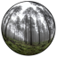
<div style="width:290px">&nbsp;&nbsp;&nbsp;&nbsp;&nbsp;&nbsp;&nbsp;&nbsp;&nbsp;&nbsp;&nbsp;&nbsp;&nbsp;</div> 
</td>
<td> 

#### Skybox

A classical way of generating sky and background in games is to render a cube or spherical map on the far plane (behind all other objects). This method is called [CubeMap](https://learnopengl.com/Advanced-OpenGL/Cubemaps), [SkyBox](https://en.wikipedia.org/wiki/Skybox_(video_games)) or SkyDome.

This simple demo shows this technique on a spherical texture from [HDRI Haven](https://hdrihaven.com/).
</td> 
<td>
<div style="width:290px">&nbsp;&nbsp;&nbsp;&nbsp;&nbsp;&nbsp;&nbsp;&nbsp;&nbsp;&nbsp;&nbsp;&nbsp;&nbsp;</div> 
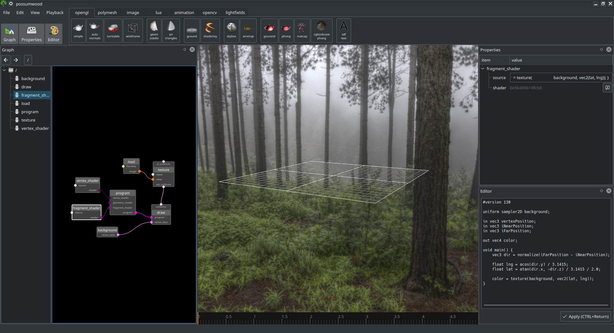
<div style="width:290px">&nbsp;&nbsp;&nbsp;&nbsp;&nbsp;&nbsp;&nbsp;&nbsp;&nbsp;&nbsp;&nbsp;&nbsp;&nbsp;</div> 
</td>
</tr> 
<tr> 
<td>
<div style="width:290px">&nbsp;&nbsp;&nbsp;&nbsp;&nbsp;&nbsp;&nbsp;&nbsp;&nbsp;&nbsp;&nbsp;&nbsp;&nbsp;</div> 
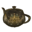
<div style="width:290px">&nbsp;&nbsp;&nbsp;&nbsp;&nbsp;&nbsp;&nbsp;&nbsp;&nbsp;&nbsp;&nbsp;&nbsp;&nbsp;</div> 
</td>
<td> 

#### Reflection mapping

[Reflection mapping](https://en.wikipedia.org/wiki/Reflection_mapping) is a simple image-based lighting technique for simulating purely reflective materials. It only behaves correcty for convex shapes, but even with this strict limitation, it has [been long established](http://www.pauldebevec.com/ReflectionMapping/) as a simple method for reflective surfaces in computer graphics.

This demo combines a skybox with a "purely reflective" material.


</td> 
<td>
<div style="width:290px">&nbsp;&nbsp;&nbsp;&nbsp;&nbsp;&nbsp;&nbsp;&nbsp;&nbsp;&nbsp;&nbsp;&nbsp;&nbsp;</div> 
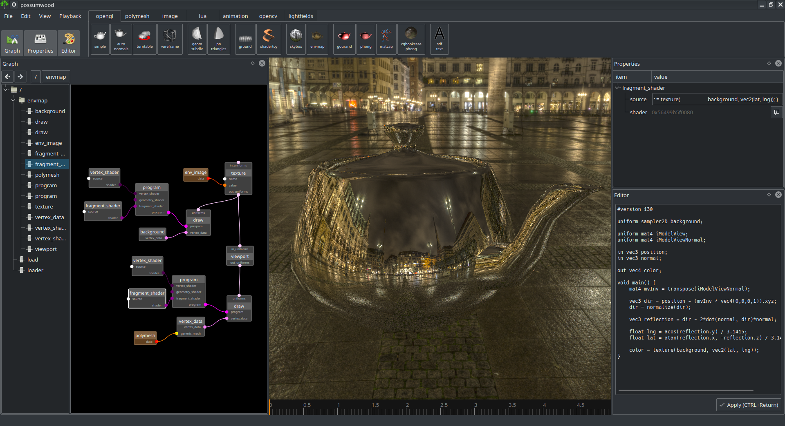
<div style="width:290px">&nbsp;&nbsp;&nbsp;&nbsp;&nbsp;&nbsp;&nbsp;&nbsp;&nbsp;&nbsp;&nbsp;&nbsp;&nbsp;</div> 
</td>
</tr> 
<tr> 
<td>
<div style="width:290px">&nbsp;&nbsp;&nbsp;&nbsp;&nbsp;&nbsp;&nbsp;&nbsp;&nbsp;&nbsp;&nbsp;&nbsp;&nbsp;</div> 

<div style="width:290px">&nbsp;&nbsp;&nbsp;&nbsp;&nbsp;&nbsp;&nbsp;&nbsp;&nbsp;&nbsp;&nbsp;&nbsp;&nbsp;</div> 
</td>
<td> 

#### Gourand shading

[Gourand shading](https://en.wikipedia.org/wiki/Gouraud_shading) is one of the simplest method of polygonal mesh shading. It computes colour by linearly interpolating vertex colours in screen space, making it cheap but less physically accurate than Phong or physics-based shading methods.

This demo combines [Gourand shading](https://en.wikipedia.org/wiki/Gouraud_shading) with [Phong reflection](https://en.wikipedia.org/wiki/Phong_reflection_model) model, reproducing an old "fixed-pipeline" shading model of OpenGL.
</td> 
<td>
<div style="width:290px">&nbsp;&nbsp;&nbsp;&nbsp;&nbsp;&nbsp;&nbsp;&nbsp;&nbsp;&nbsp;&nbsp;&nbsp;&nbsp;</div> 
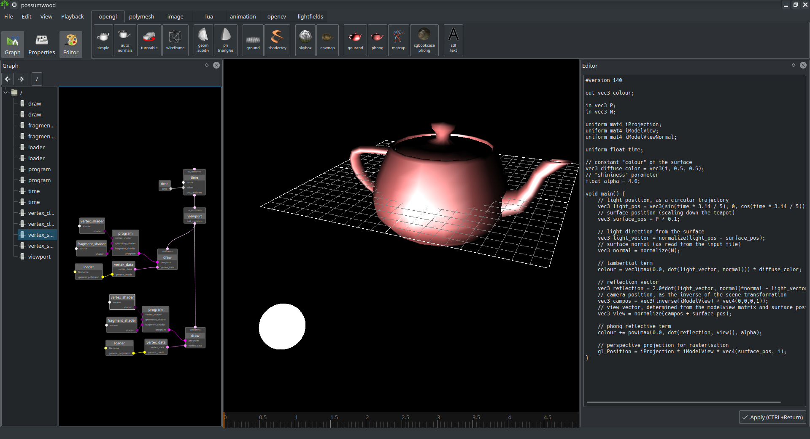
<div style="width:290px">&nbsp;&nbsp;&nbsp;&nbsp;&nbsp;&nbsp;&nbsp;&nbsp;&nbsp;&nbsp;&nbsp;&nbsp;&nbsp;</div> 
</td>
</tr> 
<tr> 
<td>
<div style="width:290px">&nbsp;&nbsp;&nbsp;&nbsp;&nbsp;&nbsp;&nbsp;&nbsp;&nbsp;&nbsp;&nbsp;&nbsp;&nbsp;</div> 
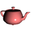
<div style="width:290px">&nbsp;&nbsp;&nbsp;&nbsp;&nbsp;&nbsp;&nbsp;&nbsp;&nbsp;&nbsp;&nbsp;&nbsp;&nbsp;</div> 
</td>
<td> 

#### Phong shading

[Phong shading](https://en.wikipedia.org/wiki/Phong_shading) computes lighting of a surface by interpolating per-pixel surface normal. Compared to Gourand shading, this method leads to smoother and more realistic surface looks better describing the shape of the object, and significantly more accurate high-frequency components computation (i.e., specular component in the [Phong lighting model](https://en.wikipedia.org/wiki/Phong_reflection_model)).

This demo implements [Phong shading](https://en.wikipedia.org/wiki/Phong_shading) with a [Phong reflection model](https://en.wikipedia.org/wiki/Phong_reflection_model) and a single point light source. The setup is wrapped in a subnetwork - just double-click the blue node to "enter" it.
</td> 
<td>
<div style="width:290px">&nbsp;&nbsp;&nbsp;&nbsp;&nbsp;&nbsp;&nbsp;&nbsp;&nbsp;&nbsp;&nbsp;&nbsp;&nbsp;</div> 

<div style="width:290px">&nbsp;&nbsp;&nbsp;&nbsp;&nbsp;&nbsp;&nbsp;&nbsp;&nbsp;&nbsp;&nbsp;&nbsp;&nbsp;</div> 
</td>
</tr> 
<tr> 
<td>
<div style="width:290px">&nbsp;&nbsp;&nbsp;&nbsp;&nbsp;&nbsp;&nbsp;&nbsp;&nbsp;&nbsp;&nbsp;&nbsp;&nbsp;</div> 
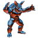
<div style="width:290px">&nbsp;&nbsp;&nbsp;&nbsp;&nbsp;&nbsp;&nbsp;&nbsp;&nbsp;&nbsp;&nbsp;&nbsp;&nbsp;</div> 
</td>
<td> 

#### Material capture shader

[MatCap or LitSphere](https://www.clicktorelease.com/code/spherical-environment-mapping/) is a simple technique for representing the properties of both the material and the environment light in a single texture. By "baking in" the two dimensions of BRDF representing incoming light, MatCap determines the final colour solely by using the difference vector between the view ray and the surface normal.

This  simple approach can yield surprisingly realistic results, and has been used in [games](https://wiki.unity3d.com/index.php/MatCap), [scultping software](https://pixologic.com/zbrush/downloadcenter/library/) and for capturing and representing artistic styles.

<sub>Sloan, Peter-Pike J., et al. ["The lit sphere: A model for capturing NPR shading from art."](http://citeseerx.ist.psu.edu/viewdoc/download?doi=10.1.1.445.6888&rep=rep1&type=pdf) Graphics interface. Vol. 2001. 2001.</sub>
</td> 
<td>
<div style="width:290px">&nbsp;&nbsp;&nbsp;&nbsp;&nbsp;&nbsp;&nbsp;&nbsp;&nbsp;&nbsp;&nbsp;&nbsp;&nbsp;</div> 
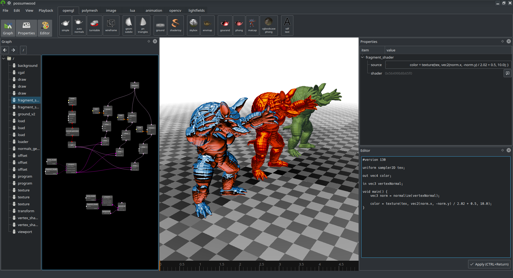
<div style="width:290px">&nbsp;&nbsp;&nbsp;&nbsp;&nbsp;&nbsp;&nbsp;&nbsp;&nbsp;&nbsp;&nbsp;&nbsp;&nbsp;</div> 
</td>
</tr> 
<tr> 
<td>
<div style="width:290px">&nbsp;&nbsp;&nbsp;&nbsp;&nbsp;&nbsp;&nbsp;&nbsp;&nbsp;&nbsp;&nbsp;&nbsp;&nbsp;</div> 
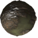
<div style="width:290px">&nbsp;&nbsp;&nbsp;&nbsp;&nbsp;&nbsp;&nbsp;&nbsp;&nbsp;&nbsp;&nbsp;&nbsp;&nbsp;</div> 
</td>
<td> 

#### Normal mapping

[Normal mapping](https://en.wikipedia.org/wiki/Normal_mapping) is a simple method for adding texture-based geometry details to a coarse model. It uses a texture to represent normal perturbation that would result from a significantly more detail in the surface mesh, without having to represent that detail explicitly in the underlying geometry.  In games, this technique is often used to represent a complex model with all its detail, without having to explicitly store a heavy geometry.

This simple demo demonstrates a combination of normal mapping implemented in a fragment shader, together with [displacement mapping](https://en.wikipedia.org/wiki/Displacement_mapping) implemented as a geometry shader. The lighting is implemented as a simple single light-source [Phong reflection model](https://en.wikipedia.org/wiki/Phong_reflection_model).

<sub>Blinn, James F. ["Simulation of wrinkled surfaces."](https://dl.acm.org/citation.cfm?id=507101) ACM SIGGRAPH computer graphics. Vol. 12. No. 3. ACM, 1978.</sub>
<sub>Mikkelsen, Morten. ["Simulation of wrinkled surfaces revisited."](http://image.diku.dk/projects/media/morten.mikkelsen.08.pdf) (2008).</sub>
</td> 
<td>
<div style="width:290px">&nbsp;&nbsp;&nbsp;&nbsp;&nbsp;&nbsp;&nbsp;&nbsp;&nbsp;&nbsp;&nbsp;&nbsp;&nbsp;</div> 
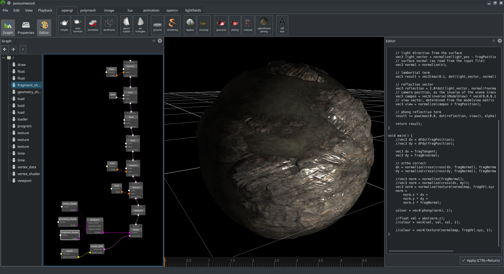
<div style="width:290px">&nbsp;&nbsp;&nbsp;&nbsp;&nbsp;&nbsp;&nbsp;&nbsp;&nbsp;&nbsp;&nbsp;&nbsp;&nbsp;</div> 
</td>
</tr> 
<tr> 
<td>
<div style="width:290px">&nbsp;&nbsp;&nbsp;&nbsp;&nbsp;&nbsp;&nbsp;&nbsp;&nbsp;&nbsp;&nbsp;&nbsp;&nbsp;</div> 

<div style="width:290px">&nbsp;&nbsp;&nbsp;&nbsp;&nbsp;&nbsp;&nbsp;&nbsp;&nbsp;&nbsp;&nbsp;&nbsp;&nbsp;</div> 
</td>
<td> 

#### SDF-based text rendering

Rendering text in OpenGL is usually implemented using a simple texture. However, such text "pixelates" when viewed up-close. [A simple method to improve on its appearance](https://github.com/libgdx/libgdx/wiki/Distance-field-fonts) uses a [Signed distance function](https://en.wikipedia.org/wiki/Signed_distance_function) to represent letter boundaries - by exploiting the interpolation abilities of GPU hardware, it is possible to represent a text boundary with significantly more precision by using the directional information represented in SDF texture differential.

This demo shows a simple implementation of this technique.

<sub>Green, Chris. ["Improved alpha-tested magnification for vector textures and special effects."](https://steamcdn-a.akamaihd.net/apps/valve/2007/SIGGRAPH2007_AlphaTestedMagnification.pdf) ACM SIGGRAPH 2007 courses. ACM, 2007.</sub>
</td> 
<td>
<div style="width:290px">&nbsp;&nbsp;&nbsp;&nbsp;&nbsp;&nbsp;&nbsp;&nbsp;&nbsp;&nbsp;&nbsp;&nbsp;&nbsp;</div> 
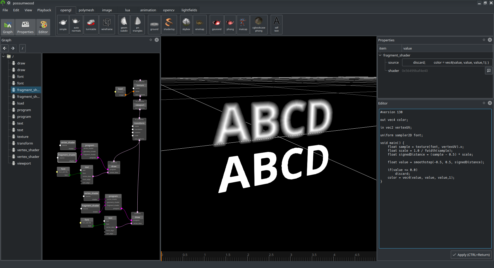
<div style="width:290px">&nbsp;&nbsp;&nbsp;&nbsp;&nbsp;&nbsp;&nbsp;&nbsp;&nbsp;&nbsp;&nbsp;&nbsp;&nbsp;</div> 
</td>
</tr> 
</table> 

### Polymesh
<table> 
<tr> 
<td>
<div style="width:290px">&nbsp;&nbsp;&nbsp;&nbsp;&nbsp;&nbsp;&nbsp;&nbsp;&nbsp;&nbsp;&nbsp;&nbsp;&nbsp;</div> 
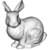
<div style="width:290px">&nbsp;&nbsp;&nbsp;&nbsp;&nbsp;&nbsp;&nbsp;&nbsp;&nbsp;&nbsp;&nbsp;&nbsp;&nbsp;</div> 
</td>
<td> 

#### OBJ file loading

This simple demo shows how to load an object from `.obj` file, and display it in the viewport.

The display code is contained in a subnetwork (double click the blue node to "enter" it), and is based on a trivial implementation of a vertex and fragment OpenGL shader.
</td> 
<td>
<div style="width:290px">&nbsp;&nbsp;&nbsp;&nbsp;&nbsp;&nbsp;&nbsp;&nbsp;&nbsp;&nbsp;&nbsp;&nbsp;&nbsp;</div> 

<div style="width:290px">&nbsp;&nbsp;&nbsp;&nbsp;&nbsp;&nbsp;&nbsp;&nbsp;&nbsp;&nbsp;&nbsp;&nbsp;&nbsp;</div> 
</td>
</tr> 
<tr> 
<td>
<div style="width:290px">&nbsp;&nbsp;&nbsp;&nbsp;&nbsp;&nbsp;&nbsp;&nbsp;&nbsp;&nbsp;&nbsp;&nbsp;&nbsp;</div> 
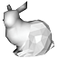
<div style="width:290px">&nbsp;&nbsp;&nbsp;&nbsp;&nbsp;&nbsp;&nbsp;&nbsp;&nbsp;&nbsp;&nbsp;&nbsp;&nbsp;</div> 
</td>
<td> 

#### CGAL normals generation

To display a polygonal mesh on a GPU, the model needs to contain surface-normal information for shading. While this information can be auto-generated, an explicitly represented normal can improve surface properties like smoothness or shape details.

This simple demo shows [two methods of computing normals](https://doc.cgal.org/latest/Polygon_mesh_processing/index.html#PMPNormalComp) using the [CGAL library](https://www.cgal.org).
</td> 
<td>
<div style="width:290px">&nbsp;&nbsp;&nbsp;&nbsp;&nbsp;&nbsp;&nbsp;&nbsp;&nbsp;&nbsp;&nbsp;&nbsp;&nbsp;</div> 
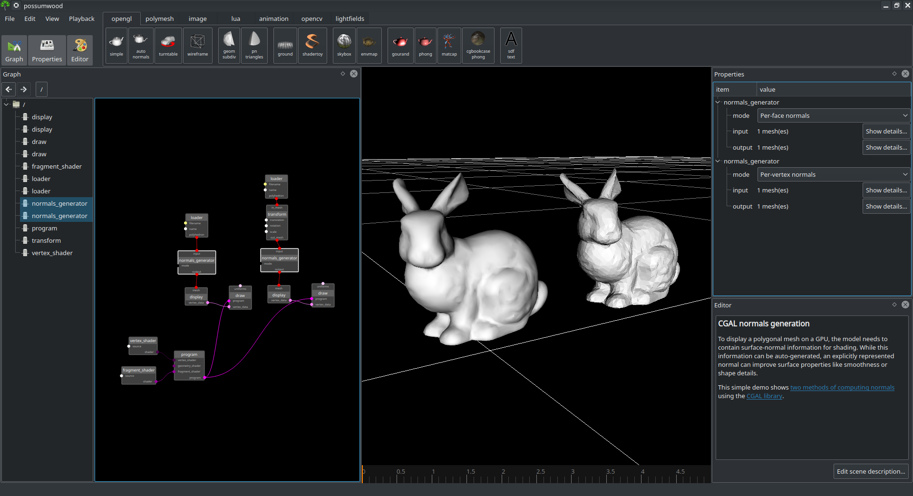
<div style="width:290px">&nbsp;&nbsp;&nbsp;&nbsp;&nbsp;&nbsp;&nbsp;&nbsp;&nbsp;&nbsp;&nbsp;&nbsp;&nbsp;</div> 
</td>
</tr> 
<tr> 
<td>
<div style="width:290px">&nbsp;&nbsp;&nbsp;&nbsp;&nbsp;&nbsp;&nbsp;&nbsp;&nbsp;&nbsp;&nbsp;&nbsp;&nbsp;</div> 

<div style="width:290px">&nbsp;&nbsp;&nbsp;&nbsp;&nbsp;&nbsp;&nbsp;&nbsp;&nbsp;&nbsp;&nbsp;&nbsp;&nbsp;</div> 
</td>
<td> 

#### CGAL mesh decimation

Mesh simplification (decimation) is a common operation in mesh processing - it aims to reduce the mesh complexity without removing its details, reducing the memory footprint without compromising the quality of the resulting model.

This demo shows how to use [CGAL's implementation of mesh decimation](https://doc.cgal.org/latest/Surface_mesh_simplification/index.html) in Possumwood, allowing to experiment with its various parameters.
</td> 
<td>
<div style="width:290px">&nbsp;&nbsp;&nbsp;&nbsp;&nbsp;&nbsp;&nbsp;&nbsp;&nbsp;&nbsp;&nbsp;&nbsp;&nbsp;</div> 

<div style="width:290px">&nbsp;&nbsp;&nbsp;&nbsp;&nbsp;&nbsp;&nbsp;&nbsp;&nbsp;&nbsp;&nbsp;&nbsp;&nbsp;</div> 
</td>
</tr> 
</table> 

### Image
<table> 
<tr> 
<td>
<div style="width:290px">&nbsp;&nbsp;&nbsp;&nbsp;&nbsp;&nbsp;&nbsp;&nbsp;&nbsp;&nbsp;&nbsp;&nbsp;&nbsp;</div> 

<div style="width:290px">&nbsp;&nbsp;&nbsp;&nbsp;&nbsp;&nbsp;&nbsp;&nbsp;&nbsp;&nbsp;&nbsp;&nbsp;&nbsp;</div> 
</td>
<td> 

#### OpenCV image loading and display

This simple demo shows how to load an image using OpenCV's [`imread()`](https://docs.opencv.org/2.4/modules/highgui/doc/reading_and_writing_images_and_video.html?highlight=imread#imread) method, and pass the resulting image data to OpenGL as a texture and a set of additional metadata represented by GLSL uniforms. 

In following demos, this OpenGL setup is wrapped in a subnetwork.
</td> 
<td>
<div style="width:290px">&nbsp;&nbsp;&nbsp;&nbsp;&nbsp;&nbsp;&nbsp;&nbsp;&nbsp;&nbsp;&nbsp;&nbsp;&nbsp;</div> 

<div style="width:290px">&nbsp;&nbsp;&nbsp;&nbsp;&nbsp;&nbsp;&nbsp;&nbsp;&nbsp;&nbsp;&nbsp;&nbsp;&nbsp;</div> 
</td>
</tr> 
<tr> 
<td>
<div style="width:290px">&nbsp;&nbsp;&nbsp;&nbsp;&nbsp;&nbsp;&nbsp;&nbsp;&nbsp;&nbsp;&nbsp;&nbsp;&nbsp;</div> 

<div style="width:290px">&nbsp;&nbsp;&nbsp;&nbsp;&nbsp;&nbsp;&nbsp;&nbsp;&nbsp;&nbsp;&nbsp;&nbsp;&nbsp;</div> 
</td>
<td> 

#### Image loading

A simple demo showing how to load an image from a file, and display it using an OpenGL setup (wrapped in a subnetwork - enter it by double-clicking the blue node).
</td> 
<td>
<div style="width:290px">&nbsp;&nbsp;&nbsp;&nbsp;&nbsp;&nbsp;&nbsp;&nbsp;&nbsp;&nbsp;&nbsp;&nbsp;&nbsp;</div> 

<div style="width:290px">&nbsp;&nbsp;&nbsp;&nbsp;&nbsp;&nbsp;&nbsp;&nbsp;&nbsp;&nbsp;&nbsp;&nbsp;&nbsp;</div> 
</td>
</tr> 
<tr> 
<td>
<div style="width:290px">&nbsp;&nbsp;&nbsp;&nbsp;&nbsp;&nbsp;&nbsp;&nbsp;&nbsp;&nbsp;&nbsp;&nbsp;&nbsp;</div> 

<div style="width:290px">&nbsp;&nbsp;&nbsp;&nbsp;&nbsp;&nbsp;&nbsp;&nbsp;&nbsp;&nbsp;&nbsp;&nbsp;&nbsp;</div> 
</td>
<td> 

#### Fullscreen image display

While Possumwood's viewport is primarily intended for viewing 3D content, using a set of shaders it is possible to alter it to display 2D textures as well.

This demo uses shaders that ignore the perspective projection matrix and draw 2D image in a 2D front-facing view in the viewport.
</td> 
<td>
<div style="width:290px">&nbsp;&nbsp;&nbsp;&nbsp;&nbsp;&nbsp;&nbsp;&nbsp;&nbsp;&nbsp;&nbsp;&nbsp;&nbsp;</div> 
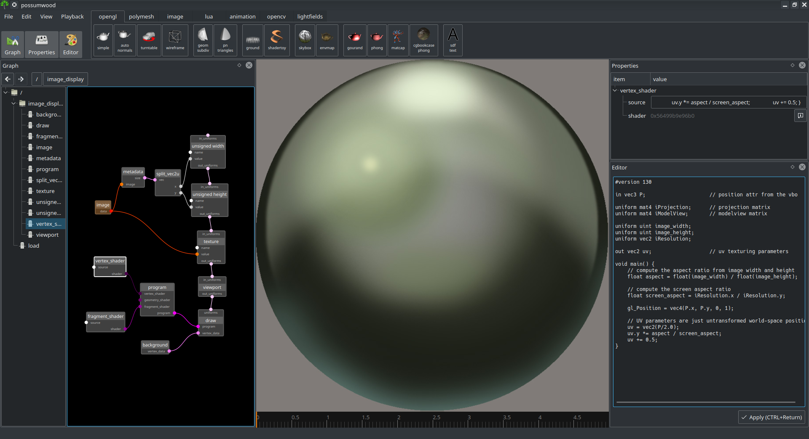
<div style="width:290px">&nbsp;&nbsp;&nbsp;&nbsp;&nbsp;&nbsp;&nbsp;&nbsp;&nbsp;&nbsp;&nbsp;&nbsp;&nbsp;</div> 
</td>
</tr> 
<tr> 
<td>
<div style="width:290px">&nbsp;&nbsp;&nbsp;&nbsp;&nbsp;&nbsp;&nbsp;&nbsp;&nbsp;&nbsp;&nbsp;&nbsp;&nbsp;</div> 

<div style="width:290px">&nbsp;&nbsp;&nbsp;&nbsp;&nbsp;&nbsp;&nbsp;&nbsp;&nbsp;&nbsp;&nbsp;&nbsp;&nbsp;</div> 
</td>
<td> 

#### Grayscale conversion

Color conversion in OpenCV is implemented in the [`cvtColor()`](https://docs.opencv.org/2.4/modules/imgproc/doc/miscellaneous_transformations.html?#cvtcolor) function. This demo shows how to use the corresponding `color` node to first convert to grayscale, and then back to BGR to allow the image to be passed to OpenGL as RGB data.
</td> 
<td>
<div style="width:290px">&nbsp;&nbsp;&nbsp;&nbsp;&nbsp;&nbsp;&nbsp;&nbsp;&nbsp;&nbsp;&nbsp;&nbsp;&nbsp;</div> 
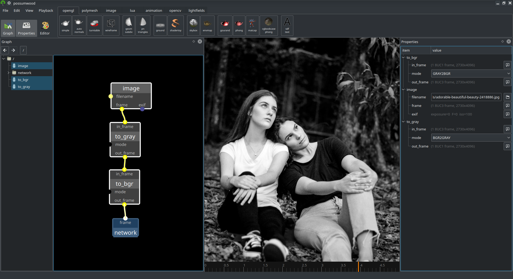
<div style="width:290px">&nbsp;&nbsp;&nbsp;&nbsp;&nbsp;&nbsp;&nbsp;&nbsp;&nbsp;&nbsp;&nbsp;&nbsp;&nbsp;</div> 
</td>
</tr> 
</table> 

### Lua
<table> 
<tr> 
<td>
<div style="width:290px">&nbsp;&nbsp;&nbsp;&nbsp;&nbsp;&nbsp;&nbsp;&nbsp;&nbsp;&nbsp;&nbsp;&nbsp;&nbsp;</div> 
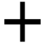
<div style="width:290px">&nbsp;&nbsp;&nbsp;&nbsp;&nbsp;&nbsp;&nbsp;&nbsp;&nbsp;&nbsp;&nbsp;&nbsp;&nbsp;</div> 
</td>
<td> 

#### Lua addition node

This simple demo shows how to create a subnetwork performing simple addition (and exposing input parameters) with a simple Lua script.

Double click the node too see its content.
</td> 
<td>
<div style="width:290px">&nbsp;&nbsp;&nbsp;&nbsp;&nbsp;&nbsp;&nbsp;&nbsp;&nbsp;&nbsp;&nbsp;&nbsp;&nbsp;</div> 

<div style="width:290px">&nbsp;&nbsp;&nbsp;&nbsp;&nbsp;&nbsp;&nbsp;&nbsp;&nbsp;&nbsp;&nbsp;&nbsp;&nbsp;</div> 
</td>
</tr> 
<tr> 
<td>
<div style="width:290px">&nbsp;&nbsp;&nbsp;&nbsp;&nbsp;&nbsp;&nbsp;&nbsp;&nbsp;&nbsp;&nbsp;&nbsp;&nbsp;</div> 

<div style="width:290px">&nbsp;&nbsp;&nbsp;&nbsp;&nbsp;&nbsp;&nbsp;&nbsp;&nbsp;&nbsp;&nbsp;&nbsp;&nbsp;</div> 
</td>
<td> 

#### Lua multiplication node

This simple demo shows how to create a subnetwork performing simple multiplication (and exposing input parameters) with a simple Lua script.

Double click the node too see its content.
</td> 
<td>
<div style="width:290px">&nbsp;&nbsp;&nbsp;&nbsp;&nbsp;&nbsp;&nbsp;&nbsp;&nbsp;&nbsp;&nbsp;&nbsp;&nbsp;</div> 
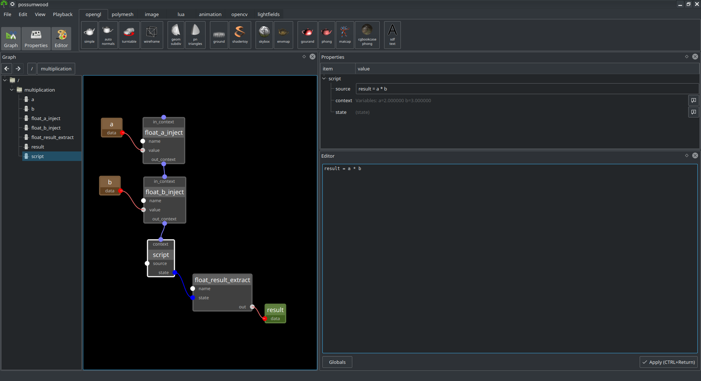
<div style="width:290px">&nbsp;&nbsp;&nbsp;&nbsp;&nbsp;&nbsp;&nbsp;&nbsp;&nbsp;&nbsp;&nbsp;&nbsp;&nbsp;</div> 
</td>
</tr> 
<tr> 
<td>
<div style="width:290px">&nbsp;&nbsp;&nbsp;&nbsp;&nbsp;&nbsp;&nbsp;&nbsp;&nbsp;&nbsp;&nbsp;&nbsp;&nbsp;</div> 
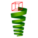
<div style="width:290px">&nbsp;&nbsp;&nbsp;&nbsp;&nbsp;&nbsp;&nbsp;&nbsp;&nbsp;&nbsp;&nbsp;&nbsp;&nbsp;</div> 
</td>
<td> 

#### Animated cube

A simple demo showing how to use a Lua script to create animated data, which are then fed as an input to a vector input of the `cube` node, animating its position.
</td> 
<td>
<div style="width:290px">&nbsp;&nbsp;&nbsp;&nbsp;&nbsp;&nbsp;&nbsp;&nbsp;&nbsp;&nbsp;&nbsp;&nbsp;&nbsp;</div> 

<div style="width:290px">&nbsp;&nbsp;&nbsp;&nbsp;&nbsp;&nbsp;&nbsp;&nbsp;&nbsp;&nbsp;&nbsp;&nbsp;&nbsp;</div> 
</td>
</tr> 
<tr> 
<td>
<div style="width:290px">&nbsp;&nbsp;&nbsp;&nbsp;&nbsp;&nbsp;&nbsp;&nbsp;&nbsp;&nbsp;&nbsp;&nbsp;&nbsp;</div> 

<div style="width:290px">&nbsp;&nbsp;&nbsp;&nbsp;&nbsp;&nbsp;&nbsp;&nbsp;&nbsp;&nbsp;&nbsp;&nbsp;&nbsp;</div> 
</td>
<td> 

#### Lua-based image synthesis

Possumwood contains a simple integration of the [Lua scripting language](https://www.lua.org/), allowing to manipulate in-scene objects using code contained in nodes.

This demo shows how to synthesize an image programatically. It "injects" the `images` plugin into the input Lua `context` (i.e., the environment for running a script), and generates an image, which is then extracted from the output `state` using an `image extract` node. The result is then passed on an image-display subnetwork.
</td> 
<td>
<div style="width:290px">&nbsp;&nbsp;&nbsp;&nbsp;&nbsp;&nbsp;&nbsp;&nbsp;&nbsp;&nbsp;&nbsp;&nbsp;&nbsp;</div> 
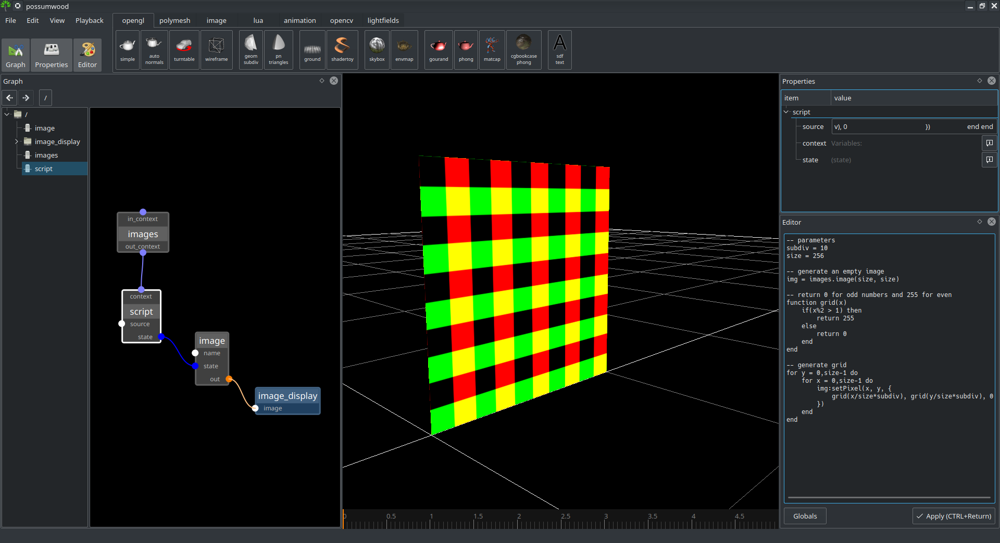
<div style="width:290px">&nbsp;&nbsp;&nbsp;&nbsp;&nbsp;&nbsp;&nbsp;&nbsp;&nbsp;&nbsp;&nbsp;&nbsp;&nbsp;</div> 
</td>
</tr> 
<tr> 
<td>
<div style="width:290px">&nbsp;&nbsp;&nbsp;&nbsp;&nbsp;&nbsp;&nbsp;&nbsp;&nbsp;&nbsp;&nbsp;&nbsp;&nbsp;</div> 

<div style="width:290px">&nbsp;&nbsp;&nbsp;&nbsp;&nbsp;&nbsp;&nbsp;&nbsp;&nbsp;&nbsp;&nbsp;&nbsp;&nbsp;</div> 
</td>
<td> 

#### Lua expression-based image synthesis

This demo builds on the Lua Grid setup, extending it by additional parameters, and wrapping it in a subnetwork (double click any blue nodes to "enter" them).
</td> 
<td>
<div style="width:290px">&nbsp;&nbsp;&nbsp;&nbsp;&nbsp;&nbsp;&nbsp;&nbsp;&nbsp;&nbsp;&nbsp;&nbsp;&nbsp;</div> 
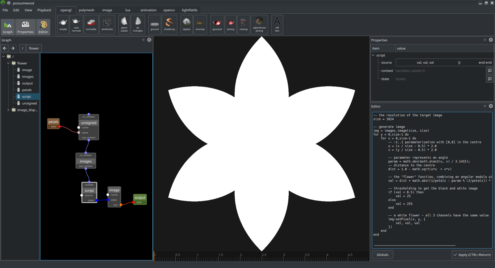
<div style="width:290px">&nbsp;&nbsp;&nbsp;&nbsp;&nbsp;&nbsp;&nbsp;&nbsp;&nbsp;&nbsp;&nbsp;&nbsp;&nbsp;</div> 
</td>
</tr> 
<tr> 
<td>
<div style="width:290px">&nbsp;&nbsp;&nbsp;&nbsp;&nbsp;&nbsp;&nbsp;&nbsp;&nbsp;&nbsp;&nbsp;&nbsp;&nbsp;</div> 

<div style="width:290px">&nbsp;&nbsp;&nbsp;&nbsp;&nbsp;&nbsp;&nbsp;&nbsp;&nbsp;&nbsp;&nbsp;&nbsp;&nbsp;</div> 
</td>
<td> 

#### Lua image tonemapping

Lua expressions in Possumwood can be also used to manipulate [HDR images](https://en.wikipedia.org/wiki/High-dynamic-range_imaging).

This demo shows how to implement simple [Gamma compression](https://en.wikipedia.org/wiki/Gamma_correction) tonemapping operator in Lua, and how to wrap it into a subnetwork with exposed parameters. Possumwood allows arbitrary nesting of nodes in this way, allowing to abstract-away any unnecessary complexity into simple nodes with clean interfaces.
</td> 
<td>
<div style="width:290px">&nbsp;&nbsp;&nbsp;&nbsp;&nbsp;&nbsp;&nbsp;&nbsp;&nbsp;&nbsp;&nbsp;&nbsp;&nbsp;</div> 

<div style="width:290px">&nbsp;&nbsp;&nbsp;&nbsp;&nbsp;&nbsp;&nbsp;&nbsp;&nbsp;&nbsp;&nbsp;&nbsp;&nbsp;</div> 
</td>
</tr> 
</table> 

### Animation
<table> 
<tr> 
<td>
<div style="width:290px">&nbsp;&nbsp;&nbsp;&nbsp;&nbsp;&nbsp;&nbsp;&nbsp;&nbsp;&nbsp;&nbsp;&nbsp;&nbsp;</div> 

<div style="width:290px">&nbsp;&nbsp;&nbsp;&nbsp;&nbsp;&nbsp;&nbsp;&nbsp;&nbsp;&nbsp;&nbsp;&nbsp;&nbsp;</div> 
</td>
<td> 

#### Animation loading

This demo shows how to load animation data from a [`.bvh`](https://research.cs.wisc.edu/graphics/Courses/cs-838-1999/Jeff/BVH.html) file (a common file used for this kind of data), and from a combination of [`.asf` and `amc`](https://research.cs.wisc.edu/graphics/Courses/cs-838-1999/Jeff/ASF-AMC.html) files (another common file format, used for the [CMU Mocap Library](http://mocap.cs.cmu.edu/)).

The loaded animation data are then processed (scaled, translated), and displayed in OpenGL using a simple skeleton render node.
</td> 
<td>
<div style="width:290px">&nbsp;&nbsp;&nbsp;&nbsp;&nbsp;&nbsp;&nbsp;&nbsp;&nbsp;&nbsp;&nbsp;&nbsp;&nbsp;</div> 

<div style="width:290px">&nbsp;&nbsp;&nbsp;&nbsp;&nbsp;&nbsp;&nbsp;&nbsp;&nbsp;&nbsp;&nbsp;&nbsp;&nbsp;</div> 
</td>
</tr> 
<tr> 
<td>
<div style="width:290px">&nbsp;&nbsp;&nbsp;&nbsp;&nbsp;&nbsp;&nbsp;&nbsp;&nbsp;&nbsp;&nbsp;&nbsp;&nbsp;</div> 

<div style="width:290px">&nbsp;&nbsp;&nbsp;&nbsp;&nbsp;&nbsp;&nbsp;&nbsp;&nbsp;&nbsp;&nbsp;&nbsp;&nbsp;</div> 
</td>
<td> 

#### GLSL skeleton

This demo uses GLSL (geometry shader) to generate a shaded polygonal stick figure from a set of line segments.
</td> 
<td>
<div style="width:290px">&nbsp;&nbsp;&nbsp;&nbsp;&nbsp;&nbsp;&nbsp;&nbsp;&nbsp;&nbsp;&nbsp;&nbsp;&nbsp;</div> 

<div style="width:290px">&nbsp;&nbsp;&nbsp;&nbsp;&nbsp;&nbsp;&nbsp;&nbsp;&nbsp;&nbsp;&nbsp;&nbsp;&nbsp;</div> 
</td>
</tr> 
<tr> 
<td>
<div style="width:290px">&nbsp;&nbsp;&nbsp;&nbsp;&nbsp;&nbsp;&nbsp;&nbsp;&nbsp;&nbsp;&nbsp;&nbsp;&nbsp;</div> 

<div style="width:290px">&nbsp;&nbsp;&nbsp;&nbsp;&nbsp;&nbsp;&nbsp;&nbsp;&nbsp;&nbsp;&nbsp;&nbsp;&nbsp;</div> 
</td>
<td> 

#### Periodic animation

A motion capture data source captures reality, and due to both capturing noise and imperfections, a locomotion or another periodic motion will never be perfectly periodic.

This demo uses a simple hierarchical linear blend to convert motion capture data to a periodic animation. To allow user to understand the input data well, the user interface uses a simple display of per-frame comparison error metric, similar to Kovar et al.'s [Motion Graphs](http://graphics.cs.wisc.edu/Papers/2002/KGP02/mograph.pdf).

<sub>Kovar, Lucas, Michael Gleicher, and Fr&#233;d&#233;ric Pighin. ["Motion graphs."](http://graphics.cs.wisc.edu/Papers/2002/KGP02/mograph.pdf) ACM SIGGRAPH 2008 classes. ACM, 2008.</sub>
</td> 
<td>
<div style="width:290px">&nbsp;&nbsp;&nbsp;&nbsp;&nbsp;&nbsp;&nbsp;&nbsp;&nbsp;&nbsp;&nbsp;&nbsp;&nbsp;</div> 
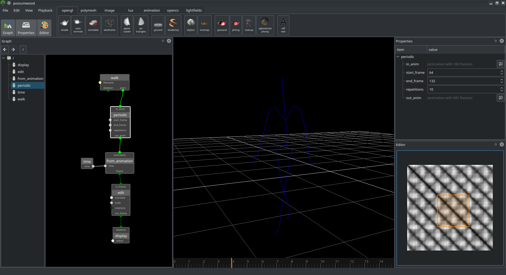
<div style="width:290px">&nbsp;&nbsp;&nbsp;&nbsp;&nbsp;&nbsp;&nbsp;&nbsp;&nbsp;&nbsp;&nbsp;&nbsp;&nbsp;</div> 
</td>
</tr> 
<tr> 
<td>
<div style="width:290px">&nbsp;&nbsp;&nbsp;&nbsp;&nbsp;&nbsp;&nbsp;&nbsp;&nbsp;&nbsp;&nbsp;&nbsp;&nbsp;</div> 
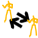
<div style="width:290px">&nbsp;&nbsp;&nbsp;&nbsp;&nbsp;&nbsp;&nbsp;&nbsp;&nbsp;&nbsp;&nbsp;&nbsp;&nbsp;</div> 
</td>
<td> 

#### Animation transition

A linear blend is the simplest way to transition between two animations. This demo shows how a hand-picked linear blend can be used in Possumwood to transition between two animations. To assist the user with picking the blending point, the editor window displays a visualisation of frame similarity metric, similar to Kovar et al.'s Motion Graphs.

<sub>Kovar, Lucas, Michael Gleicher, and Fr&#233;d&#233;ric Pighin. ["Motion graphs."](http://graphics.cs.wisc.edu/Papers/2002/KGP02/mograph.pdf) ACM SIGGRAPH 2008 classes. ACM, 2008.</sub>
</td> 
<td>
<div style="width:290px">&nbsp;&nbsp;&nbsp;&nbsp;&nbsp;&nbsp;&nbsp;&nbsp;&nbsp;&nbsp;&nbsp;&nbsp;&nbsp;</div> 

<div style="width:290px">&nbsp;&nbsp;&nbsp;&nbsp;&nbsp;&nbsp;&nbsp;&nbsp;&nbsp;&nbsp;&nbsp;&nbsp;&nbsp;</div> 
</td>
</tr> 
<tr> 
<td>
<div style="width:290px">&nbsp;&nbsp;&nbsp;&nbsp;&nbsp;&nbsp;&nbsp;&nbsp;&nbsp;&nbsp;&nbsp;&nbsp;&nbsp;</div> 
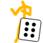
<div style="width:290px">&nbsp;&nbsp;&nbsp;&nbsp;&nbsp;&nbsp;&nbsp;&nbsp;&nbsp;&nbsp;&nbsp;&nbsp;&nbsp;</div> 
</td>
<td> 

#### Motion graph random walk

A motion graph is a simple directional graph data structure describing possible transition points between a number of motion clips. Each transition is determined by comparing kinematic and dynamic properties of corresponding frames, which should lead to a transition that does not introduce any salient discontinuities or artifacts.

A random walk through such a graph would generate a variation of the original motion(s) by adding random transitions.

This demo shows a random walk through a motion graph. In its current state, it does not attempt to synthesize smooth continuous transitions - it just switches between different clips. (todo: introduce smooth transitions)

<sub>Kovar, Lucas, Michael Gleicher, and Fr&#233;d&#233;ric Pighin. ["Motion graphs."](https://graphics.cs.wisc.edu/Papers/2002/KGP02/mograph.pdf) ACM Transactions on Graphics (TOG). Vol. 21. No. 3. ACM, 2002.</sub>

<sub>Kovar, Lucas, Michael Gleicher, and Fr&#233;d&#233;ric Pighin. ["Motion graphs."](http://graphics.cs.wisc.edu/Papers/2002/KGP02/mograph.pdf) ACM SIGGRAPH 2008 classes. ACM, 2008.</sub>
</td> 
<td>
<div style="width:290px">&nbsp;&nbsp;&nbsp;&nbsp;&nbsp;&nbsp;&nbsp;&nbsp;&nbsp;&nbsp;&nbsp;&nbsp;&nbsp;</div> 

<div style="width:290px">&nbsp;&nbsp;&nbsp;&nbsp;&nbsp;&nbsp;&nbsp;&nbsp;&nbsp;&nbsp;&nbsp;&nbsp;&nbsp;</div> 
</td>
</tr> 
<tr> 
<td>
<div style="width:290px">&nbsp;&nbsp;&nbsp;&nbsp;&nbsp;&nbsp;&nbsp;&nbsp;&nbsp;&nbsp;&nbsp;&nbsp;&nbsp;</div> 
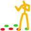
<div style="width:290px">&nbsp;&nbsp;&nbsp;&nbsp;&nbsp;&nbsp;&nbsp;&nbsp;&nbsp;&nbsp;&nbsp;&nbsp;&nbsp;</div> 
</td>
<td> 

#### Footstep detection

Animations represented as sequences of poses of hierarchical skeletons do not naturally represent information about character interaction with the environment. This information is necessary for motion editing to maintain desirable properties, such as realistic stationary footsteps. A number of methods has been used to perform this task, but a simple velocity thresholding has proven sufficient for most practical applications.

This demo shows how this simple technique can be used in Possumwood. The resulting constraint information can be further processed via median filtering, to remove any noise introduced in the detection process.

<sub>Kovar, Lucas, John Schreiner, and Michael Gleicher. ["Footskate cleanup for motion capture editing."](http://kucg.korea.ac.kr/seminar/2005/src/PA-05-01.pdf) Proceedings of the 2002 ACM SIGGRAPH/Eurographics symposium on Computer animation. ACM, 2002.</sub>

<sub>Ikemoto, Leslie, Okan Arikan, and David Forsyth. ["Knowing when to put your foot down."](http://citeseerx.ist.psu.edu/viewdoc/download?doi=10.1.1.151.1882&rep=rep1&type=pdf) Proceedings of the 2006 symposium on Interactive 3D graphics and games. ACM, 2006.</sub>
</td> 
<td>
<div style="width:290px">&nbsp;&nbsp;&nbsp;&nbsp;&nbsp;&nbsp;&nbsp;&nbsp;&nbsp;&nbsp;&nbsp;&nbsp;&nbsp;</div> 
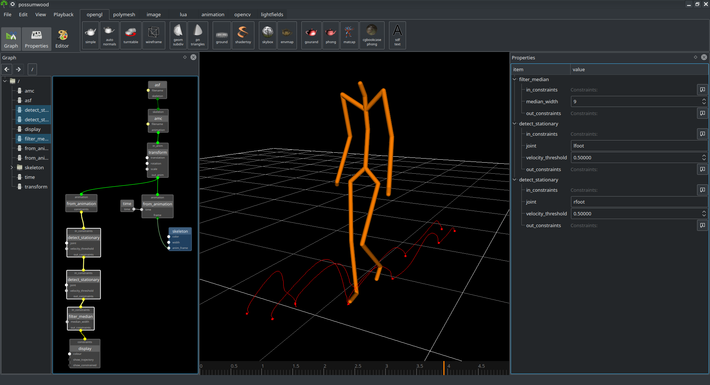
<div style="width:290px">&nbsp;&nbsp;&nbsp;&nbsp;&nbsp;&nbsp;&nbsp;&nbsp;&nbsp;&nbsp;&nbsp;&nbsp;&nbsp;</div> 
</td>
</tr> 
</table> 

### Opencv
<table> 
<tr> 
<td>
<div style="width:290px">&nbsp;&nbsp;&nbsp;&nbsp;&nbsp;&nbsp;&nbsp;&nbsp;&nbsp;&nbsp;&nbsp;&nbsp;&nbsp;</div> 
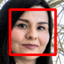
<div style="width:290px">&nbsp;&nbsp;&nbsp;&nbsp;&nbsp;&nbsp;&nbsp;&nbsp;&nbsp;&nbsp;&nbsp;&nbsp;&nbsp;</div> 
</td>
<td> 

#### Face detection using Haar cascades

This demo follows the OpenCV's [Haar Cascade](https://docs.opencv.org/3.4/db/d28/tutorial_cascade_classifier.html) tutorial - it allows to load a Haar Cascade `.xml` file in OpenCV's format, use it to detect faces in the input image, and then draw the result into the source image for display.

Lienhart, Rainer, and Jochen Maydt. ["An extended set of haar-like features for rapid object detection."](http://www.staroceans.org/documents/ICIP2002.pdf) Proceedings. international conference on image processing. Vol. 1. IEEE, 2002.
</td> 
<td>
<div style="width:290px">&nbsp;&nbsp;&nbsp;&nbsp;&nbsp;&nbsp;&nbsp;&nbsp;&nbsp;&nbsp;&nbsp;&nbsp;&nbsp;</div> 
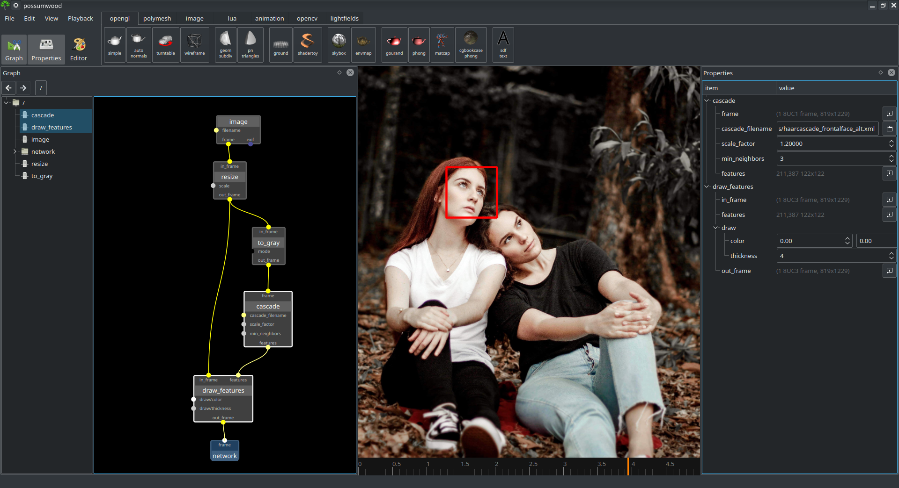
<div style="width:290px">&nbsp;&nbsp;&nbsp;&nbsp;&nbsp;&nbsp;&nbsp;&nbsp;&nbsp;&nbsp;&nbsp;&nbsp;&nbsp;</div> 
</td>
</tr> 
<tr> 
<td>
<div style="width:290px">&nbsp;&nbsp;&nbsp;&nbsp;&nbsp;&nbsp;&nbsp;&nbsp;&nbsp;&nbsp;&nbsp;&nbsp;&nbsp;</div> 

<div style="width:290px">&nbsp;&nbsp;&nbsp;&nbsp;&nbsp;&nbsp;&nbsp;&nbsp;&nbsp;&nbsp;&nbsp;&nbsp;&nbsp;</div> 
</td>
<td> 

#### Grayscale image denoising

This tutorial closely follows the [OpenCV's denoising tutorial](https://docs.opencv.org/3.4/d5/d69/tutorial_py_non_local_means.html) for grayscale images, removing the noise using the [non-local means](https://en.wikipedia.org/wiki/Non-local_means) algorithm.
</td> 
<td>
<div style="width:290px">&nbsp;&nbsp;&nbsp;&nbsp;&nbsp;&nbsp;&nbsp;&nbsp;&nbsp;&nbsp;&nbsp;&nbsp;&nbsp;</div> 
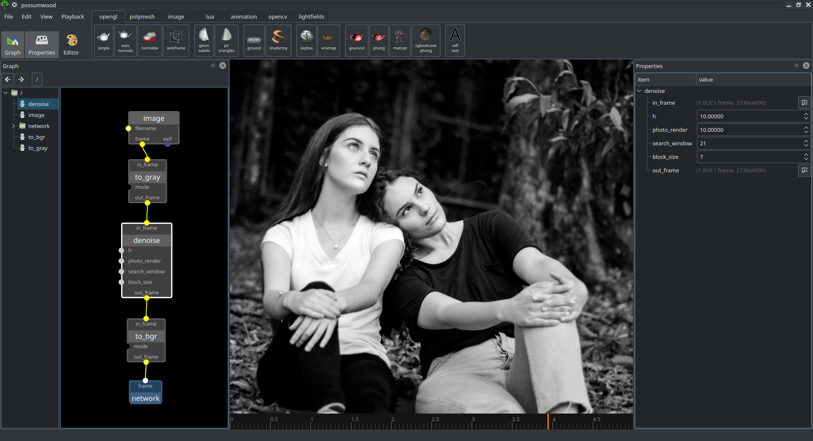
<div style="width:290px">&nbsp;&nbsp;&nbsp;&nbsp;&nbsp;&nbsp;&nbsp;&nbsp;&nbsp;&nbsp;&nbsp;&nbsp;&nbsp;</div> 
</td>
</tr> 
<tr> 
<td>
<div style="width:290px">&nbsp;&nbsp;&nbsp;&nbsp;&nbsp;&nbsp;&nbsp;&nbsp;&nbsp;&nbsp;&nbsp;&nbsp;&nbsp;</div> 
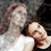
<div style="width:290px">&nbsp;&nbsp;&nbsp;&nbsp;&nbsp;&nbsp;&nbsp;&nbsp;&nbsp;&nbsp;&nbsp;&nbsp;&nbsp;</div> 
</td>
<td> 

#### Color image denoising

This tutorial closely follows the [OpenCV's denoising tutorial](https://docs.opencv.org/3.4/d5/d69/tutorial_py_non_local_means.html) for color images, removing the noise using the [non-local means](https://en.wikipedia.org/wiki/Non-local_means) algorithm.
</td> 
<td>
<div style="width:290px">&nbsp;&nbsp;&nbsp;&nbsp;&nbsp;&nbsp;&nbsp;&nbsp;&nbsp;&nbsp;&nbsp;&nbsp;&nbsp;</div> 

<div style="width:290px">&nbsp;&nbsp;&nbsp;&nbsp;&nbsp;&nbsp;&nbsp;&nbsp;&nbsp;&nbsp;&nbsp;&nbsp;&nbsp;</div> 
</td>
</tr> 
<tr> 
<td>
<div style="width:290px">&nbsp;&nbsp;&nbsp;&nbsp;&nbsp;&nbsp;&nbsp;&nbsp;&nbsp;&nbsp;&nbsp;&nbsp;&nbsp;</div> 
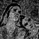
<div style="width:290px">&nbsp;&nbsp;&nbsp;&nbsp;&nbsp;&nbsp;&nbsp;&nbsp;&nbsp;&nbsp;&nbsp;&nbsp;&nbsp;</div> 
</td>
<td> 

#### Visualising luminance noise

This tutorial follows the [OpenCV's denoising tutorial](https://docs.opencv.org/3.4/d5/d69/tutorial_py_non_local_means.html) for grayscale images, but at the end of the processing it subtracts the denoised image from the original (leaving only extracted noise), and [equalises](https://en.wikipedia.org/wiki/Histogram_equalization) the result using [`cv::equalizeHist()`](https://docs.opencv.org/2.4/doc/tutorials/imgproc/histograms/histogram_equalization/histogram_equalization.html) to show the noise structure.
</td> 
<td>
<div style="width:290px">&nbsp;&nbsp;&nbsp;&nbsp;&nbsp;&nbsp;&nbsp;&nbsp;&nbsp;&nbsp;&nbsp;&nbsp;&nbsp;</div> 
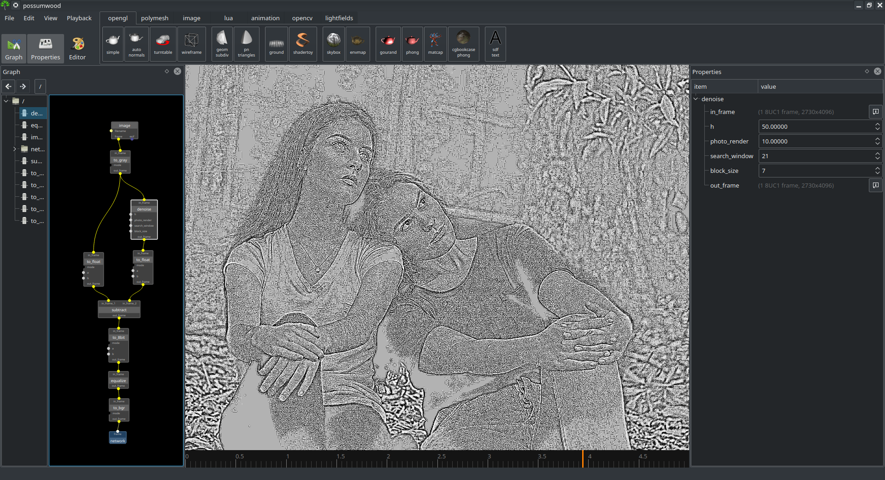
<div style="width:290px">&nbsp;&nbsp;&nbsp;&nbsp;&nbsp;&nbsp;&nbsp;&nbsp;&nbsp;&nbsp;&nbsp;&nbsp;&nbsp;</div> 
</td>
</tr> 
<tr> 
<td>
<div style="width:290px">&nbsp;&nbsp;&nbsp;&nbsp;&nbsp;&nbsp;&nbsp;&nbsp;&nbsp;&nbsp;&nbsp;&nbsp;&nbsp;</div> 
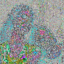
<div style="width:290px">&nbsp;&nbsp;&nbsp;&nbsp;&nbsp;&nbsp;&nbsp;&nbsp;&nbsp;&nbsp;&nbsp;&nbsp;&nbsp;</div> 
</td>
<td> 

#### Visualising color noise

This tutorial follows the [OpenCV's denoising tutorial](https://docs.opencv.org/3.4/d5/d69/tutorial_py_non_local_means.html) for color images, but at the end of the processing it subtracts the denoised image from the original (leaving only extracted noise), and [equalises](https://en.wikipedia.org/wiki/Histogram_equalization) the result using [`cv::equalizeHist()`](https://docs.opencv.org/2.4/doc/tutorials/imgproc/histograms/histogram_equalization/histogram_equalization.html) to show the noise structure.
</td> 
<td>
<div style="width:290px">&nbsp;&nbsp;&nbsp;&nbsp;&nbsp;&nbsp;&nbsp;&nbsp;&nbsp;&nbsp;&nbsp;&nbsp;&nbsp;</div> 

<div style="width:290px">&nbsp;&nbsp;&nbsp;&nbsp;&nbsp;&nbsp;&nbsp;&nbsp;&nbsp;&nbsp;&nbsp;&nbsp;&nbsp;</div> 
</td>
</tr> 
<tr> 
<td>
<div style="width:290px">&nbsp;&nbsp;&nbsp;&nbsp;&nbsp;&nbsp;&nbsp;&nbsp;&nbsp;&nbsp;&nbsp;&nbsp;&nbsp;</div> 
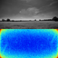
<div style="width:290px">&nbsp;&nbsp;&nbsp;&nbsp;&nbsp;&nbsp;&nbsp;&nbsp;&nbsp;&nbsp;&nbsp;&nbsp;&nbsp;</div> 
</td>
<td> 

#### Discrete Fourier Transform and a simple low-pass filter

The [Discrete Fourier Transform](https://en.wikipedia.org/wiki/Discrete_Fourier_transform) ([implemented in OpenCV](https://docs.opencv.org/3.4/d8/d01/tutorial_discrete_fourier_transform.html)) converts a signal (image) into its complex frequency spectrum. By manipulating the spectrum, it is possible to implement simple frequency filters.

This demo shows how to perform a DFT on an image, and implements a simple frequency cutoff low-pass filter, showing both the image before and after applying this filter.
</td> 
<td>
<div style="width:290px">&nbsp;&nbsp;&nbsp;&nbsp;&nbsp;&nbsp;&nbsp;&nbsp;&nbsp;&nbsp;&nbsp;&nbsp;&nbsp;</div> 

<div style="width:290px">&nbsp;&nbsp;&nbsp;&nbsp;&nbsp;&nbsp;&nbsp;&nbsp;&nbsp;&nbsp;&nbsp;&nbsp;&nbsp;</div> 
</td>
</tr> 
<tr> 
<td>
<div style="width:290px">&nbsp;&nbsp;&nbsp;&nbsp;&nbsp;&nbsp;&nbsp;&nbsp;&nbsp;&nbsp;&nbsp;&nbsp;&nbsp;</div> 

<div style="width:290px">&nbsp;&nbsp;&nbsp;&nbsp;&nbsp;&nbsp;&nbsp;&nbsp;&nbsp;&nbsp;&nbsp;&nbsp;&nbsp;</div> 
</td>
<td> 

#### Video frames

OpenCV's [VideoCapture](https://docs.opencv.org/3.4/d8/dfe/classcv_1_1VideoCapture.html) object can be used to extract frames from a video file. This demo shows how to use a `video_frame` source together with a `frame` input to link the viewport timeline with a displayed video frame.
</td> 
<td>
<div style="width:290px">&nbsp;&nbsp;&nbsp;&nbsp;&nbsp;&nbsp;&nbsp;&nbsp;&nbsp;&nbsp;&nbsp;&nbsp;&nbsp;</div> 
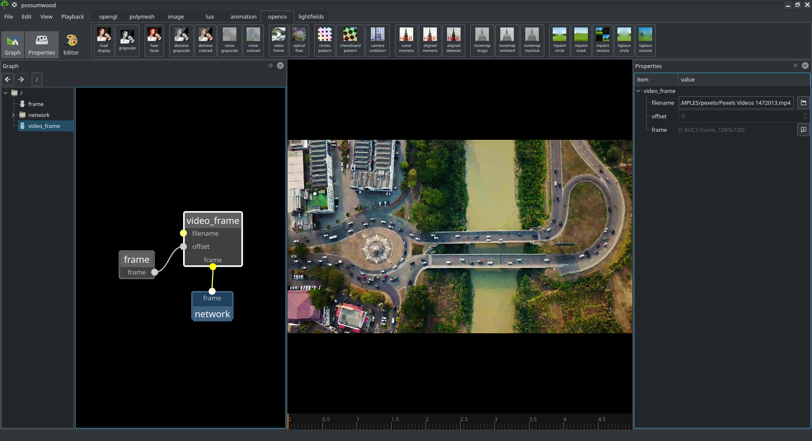
<div style="width:290px">&nbsp;&nbsp;&nbsp;&nbsp;&nbsp;&nbsp;&nbsp;&nbsp;&nbsp;&nbsp;&nbsp;&nbsp;&nbsp;</div> 
</td>
</tr> 
<tr> 
<td>
<div style="width:290px">&nbsp;&nbsp;&nbsp;&nbsp;&nbsp;&nbsp;&nbsp;&nbsp;&nbsp;&nbsp;&nbsp;&nbsp;&nbsp;</div> 

<div style="width:290px">&nbsp;&nbsp;&nbsp;&nbsp;&nbsp;&nbsp;&nbsp;&nbsp;&nbsp;&nbsp;&nbsp;&nbsp;&nbsp;</div> 
</td>
<td> 

#### Dense optical flow

OpenCV provides a method to compute dense optical flow in the [`calcOpticalFlowFarneback()`](https://docs.opencv.org/3.4/dc/d6b/group__video__track.html#ga5d10ebbd59fe09c5f650289ec0ece5af) function, allowing to detect moving objects in frames without explicitly detecting feature points first.

This demo shows how to set up this type of optical flow in Possumwood, and how to display its results as colours on top of a grayscale animated image.

<sub>Farneb&#228;ck, Gunnar. ["Two-frame motion estimation based on polynomial expansion."](https://link.springer.com/content/pdf/10.1007/3-540-45103-X_50.pdf) Scandinavian conference on Image analysis. Springer, Berlin, Heidelberg, 2003.</sub>
</td> 
<td>
<div style="width:290px">&nbsp;&nbsp;&nbsp;&nbsp;&nbsp;&nbsp;&nbsp;&nbsp;&nbsp;&nbsp;&nbsp;&nbsp;&nbsp;</div> 
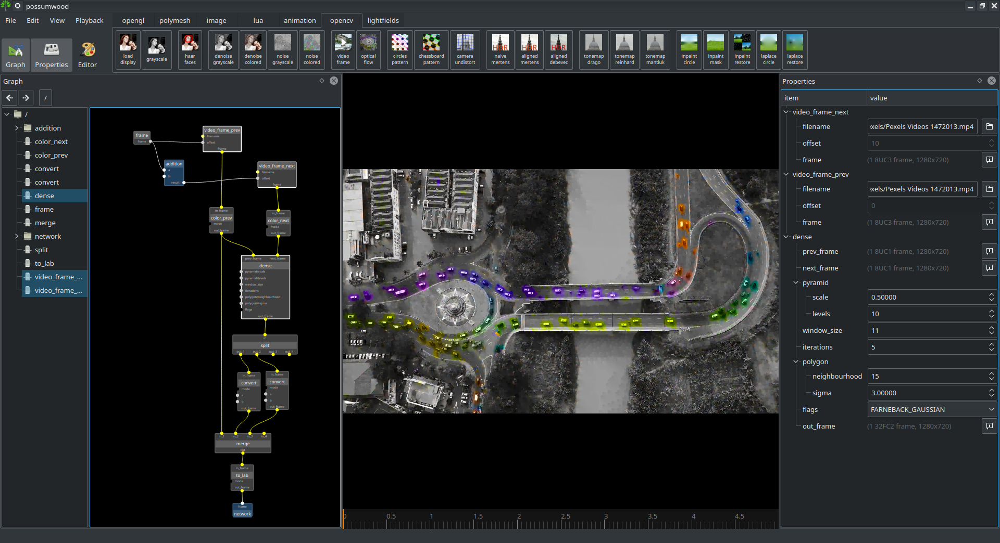
<div style="width:290px">&nbsp;&nbsp;&nbsp;&nbsp;&nbsp;&nbsp;&nbsp;&nbsp;&nbsp;&nbsp;&nbsp;&nbsp;&nbsp;</div> 
</td>
</tr> 
<tr> 
<td>
<div style="width:290px">&nbsp;&nbsp;&nbsp;&nbsp;&nbsp;&nbsp;&nbsp;&nbsp;&nbsp;&nbsp;&nbsp;&nbsp;&nbsp;</div> 
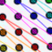
<div style="width:290px">&nbsp;&nbsp;&nbsp;&nbsp;&nbsp;&nbsp;&nbsp;&nbsp;&nbsp;&nbsp;&nbsp;&nbsp;&nbsp;</div> 
</td>
<td> 

#### Calibration pattern detection (circles)

Pattern detection is the first step of camera calibration for many computer vision algorithms. This demo shows how a pattern build of circles can be detected using Hough transformation, and assembled into a grid for the use of camera intrinsic and extrinsic calibration.
</td> 
<td>
<div style="width:290px">&nbsp;&nbsp;&nbsp;&nbsp;&nbsp;&nbsp;&nbsp;&nbsp;&nbsp;&nbsp;&nbsp;&nbsp;&nbsp;</div> 

<div style="width:290px">&nbsp;&nbsp;&nbsp;&nbsp;&nbsp;&nbsp;&nbsp;&nbsp;&nbsp;&nbsp;&nbsp;&nbsp;&nbsp;</div> 
</td>
</tr> 
<tr> 
<td>
<div style="width:290px">&nbsp;&nbsp;&nbsp;&nbsp;&nbsp;&nbsp;&nbsp;&nbsp;&nbsp;&nbsp;&nbsp;&nbsp;&nbsp;</div> 
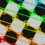
<div style="width:290px">&nbsp;&nbsp;&nbsp;&nbsp;&nbsp;&nbsp;&nbsp;&nbsp;&nbsp;&nbsp;&nbsp;&nbsp;&nbsp;</div> 
</td>
<td> 

#### Calibration pattern detection (chessboard)

Pattern detection is the first step of camera calibration for many computer vision algorithms. This demo shows how a chessboard pattern can be detected using corners feature detection, and assembled into a grid for the use of camera intrinsic and extrinsic calibration.
</td> 
<td>
<div style="width:290px">&nbsp;&nbsp;&nbsp;&nbsp;&nbsp;&nbsp;&nbsp;&nbsp;&nbsp;&nbsp;&nbsp;&nbsp;&nbsp;</div> 

<div style="width:290px">&nbsp;&nbsp;&nbsp;&nbsp;&nbsp;&nbsp;&nbsp;&nbsp;&nbsp;&nbsp;&nbsp;&nbsp;&nbsp;</div> 
</td>
</tr> 
<tr> 
<td>
<div style="width:290px">&nbsp;&nbsp;&nbsp;&nbsp;&nbsp;&nbsp;&nbsp;&nbsp;&nbsp;&nbsp;&nbsp;&nbsp;&nbsp;</div> 

<div style="width:290px">&nbsp;&nbsp;&nbsp;&nbsp;&nbsp;&nbsp;&nbsp;&nbsp;&nbsp;&nbsp;&nbsp;&nbsp;&nbsp;</div> 
</td>
<td> 

#### Camera calibration

The calibration of a camera's intrinsic parameters is an important step for most algorithms in machine vision.

This demo shows how to perform multi-image intrinsic camera calibration using a chessboard pattern, and how to use the solved parameters to undistort an image. This functionality is fully built using OpenCV's functions, wrapped in a set of Possumwood nodes.

The left side of the graph detects a pattern in a set of 4 images, accumulating the results in a `points` array; the `calibrate_camera` node computes the intrinsic calibration from a set of input sample points; the `undistort` node then uses the resulting calibration to correct the distortion of an input image.
</td> 
<td>
<div style="width:290px">&nbsp;&nbsp;&nbsp;&nbsp;&nbsp;&nbsp;&nbsp;&nbsp;&nbsp;&nbsp;&nbsp;&nbsp;&nbsp;</div> 

<div style="width:290px">&nbsp;&nbsp;&nbsp;&nbsp;&nbsp;&nbsp;&nbsp;&nbsp;&nbsp;&nbsp;&nbsp;&nbsp;&nbsp;</div> 
</td>
</tr> 
<tr> 
<td>
<div style="width:290px">&nbsp;&nbsp;&nbsp;&nbsp;&nbsp;&nbsp;&nbsp;&nbsp;&nbsp;&nbsp;&nbsp;&nbsp;&nbsp;</div> 

<div style="width:290px">&nbsp;&nbsp;&nbsp;&nbsp;&nbsp;&nbsp;&nbsp;&nbsp;&nbsp;&nbsp;&nbsp;&nbsp;&nbsp;</div> 
</td>
<td> 

#### Image inpainting using Fast Marching

Image inpainting is an image reconstruction technique, allowing to fill-in missing parts of an image based on existing pixels.

Telea's algorithm shown in this demo uses a Fast Marching method to inpaint pixels from a boundary based on surrounding pixels and boundary's normal direction.

<sub>Telea, Alexandru. ["An image inpainting technique based on the fast marching method."](https://www.rug.nl/research/portal/files/14404904/2004JGraphToolsTelea.pdf) Journal of graphics tools 9.1 (2004): 23-34.</sub>
</td> 
<td>
<div style="width:290px">&nbsp;&nbsp;&nbsp;&nbsp;&nbsp;&nbsp;&nbsp;&nbsp;&nbsp;&nbsp;&nbsp;&nbsp;&nbsp;</div> 

<div style="width:290px">&nbsp;&nbsp;&nbsp;&nbsp;&nbsp;&nbsp;&nbsp;&nbsp;&nbsp;&nbsp;&nbsp;&nbsp;&nbsp;</div> 
</td>
</tr> 
<tr> 
<td>
<div style="width:290px">&nbsp;&nbsp;&nbsp;&nbsp;&nbsp;&nbsp;&nbsp;&nbsp;&nbsp;&nbsp;&nbsp;&nbsp;&nbsp;</div> 

<div style="width:290px">&nbsp;&nbsp;&nbsp;&nbsp;&nbsp;&nbsp;&nbsp;&nbsp;&nbsp;&nbsp;&nbsp;&nbsp;&nbsp;</div> 
</td>
<td> 

#### Image inpainting using Fast Marching

Image inpainting is an image reconstruction technique, allowing to fill-in missing parts of an image based on existing pixels.

The Navier-Stokes-based algorithm shown in this demo uses a heuristic based on fluid dynamics to inpaint a large region of dark pixels in an image, obtained by image thresholding.

<sub>Bertalmio, Marcelo, Andrea L. Bertozzi, and Guillermo Sapiro. ["Navier-stokes, fluid dynamics, and image and video inpainting."](https://conservancy.umn.edu/bitstream/handle/11299/3607/1772.pdf?sequence=1) Proceedings of the 2001 IEEE Computer Society Conference on Computer Vision and Pattern Recognition. CVPR 2001. Vol. 1. IEEE, 2001.<sub>
</td> 
<td>
<div style="width:290px">&nbsp;&nbsp;&nbsp;&nbsp;&nbsp;&nbsp;&nbsp;&nbsp;&nbsp;&nbsp;&nbsp;&nbsp;&nbsp;</div> 

<div style="width:290px">&nbsp;&nbsp;&nbsp;&nbsp;&nbsp;&nbsp;&nbsp;&nbsp;&nbsp;&nbsp;&nbsp;&nbsp;&nbsp;</div> 
</td>
</tr> 
<tr> 
<td>
<div style="width:290px">&nbsp;&nbsp;&nbsp;&nbsp;&nbsp;&nbsp;&nbsp;&nbsp;&nbsp;&nbsp;&nbsp;&nbsp;&nbsp;</div> 

<div style="width:290px">&nbsp;&nbsp;&nbsp;&nbsp;&nbsp;&nbsp;&nbsp;&nbsp;&nbsp;&nbsp;&nbsp;&nbsp;&nbsp;</div> 
</td>
<td> 

#### Inpainting for image restoration

Image inpainting can be also used to attempt to restore an image where a large portion of the original data is missing.

This setup shows how an image can be partially restored using inpainting from a very sparse set of sample points.
</td> 
<td>
<div style="width:290px">&nbsp;&nbsp;&nbsp;&nbsp;&nbsp;&nbsp;&nbsp;&nbsp;&nbsp;&nbsp;&nbsp;&nbsp;&nbsp;</div> 
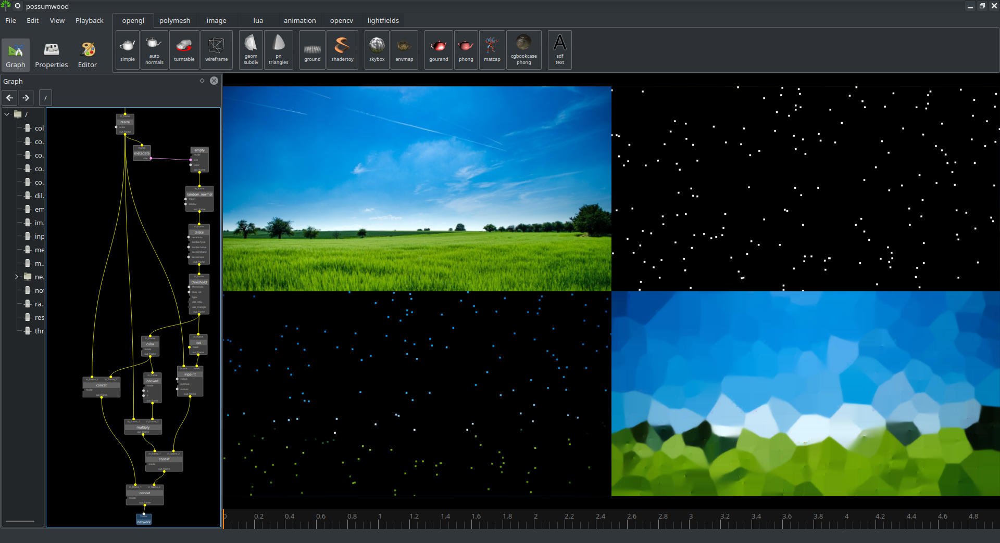
<div style="width:290px">&nbsp;&nbsp;&nbsp;&nbsp;&nbsp;&nbsp;&nbsp;&nbsp;&nbsp;&nbsp;&nbsp;&nbsp;&nbsp;</div> 
</td>
</tr> 
<tr> 
<td>
<div style="width:290px">&nbsp;&nbsp;&nbsp;&nbsp;&nbsp;&nbsp;&nbsp;&nbsp;&nbsp;&nbsp;&nbsp;&nbsp;&nbsp;</div> 

<div style="width:290px">&nbsp;&nbsp;&nbsp;&nbsp;&nbsp;&nbsp;&nbsp;&nbsp;&nbsp;&nbsp;&nbsp;&nbsp;&nbsp;</div> 
</td>
<td> 

#### Inpainting using the smoothness prior

A slightly different take on image inpainting can use the smoothness prior to try to reconstruct missing pixels in a single linear global solve step.

<sub>Cohen-Or, Daniel, et al. [A sampler of useful computational tools for applied geometry, computer graphics, and image processing.](https://pdfs.semanticscholar.org/de0c/afb6c0775ed29b79a9d947b5174092581a4e.pdf) AK Peters/CRC Press, 2015.</sub>
</td> 
<td>
<div style="width:290px">&nbsp;&nbsp;&nbsp;&nbsp;&nbsp;&nbsp;&nbsp;&nbsp;&nbsp;&nbsp;&nbsp;&nbsp;&nbsp;</div> 

<div style="width:290px">&nbsp;&nbsp;&nbsp;&nbsp;&nbsp;&nbsp;&nbsp;&nbsp;&nbsp;&nbsp;&nbsp;&nbsp;&nbsp;</div> 
</td>
</tr> 
<tr> 
<td>
<div style="width:290px">&nbsp;&nbsp;&nbsp;&nbsp;&nbsp;&nbsp;&nbsp;&nbsp;&nbsp;&nbsp;&nbsp;&nbsp;&nbsp;</div> 

<div style="width:290px">&nbsp;&nbsp;&nbsp;&nbsp;&nbsp;&nbsp;&nbsp;&nbsp;&nbsp;&nbsp;&nbsp;&nbsp;&nbsp;</div> 
</td>
<td> 

#### Image reconstruction using the smoothness prior

The smoothness prior can be also used to try to reconstruct missing pixels in a sparse set of samples using a single linear global solve step.

<sub>Cohen-Or, Daniel, et al. [A sampler of useful computational tools for applied geometry, computer graphics, and image processing.](https://pdfs.semanticscholar.org/de0c/afb6c0775ed29b79a9d947b5174092581a4e.pdf) AK Peters/CRC Press, 2015.</sub>
</td> 
<td>
<div style="width:290px">&nbsp;&nbsp;&nbsp;&nbsp;&nbsp;&nbsp;&nbsp;&nbsp;&nbsp;&nbsp;&nbsp;&nbsp;&nbsp;</div> 
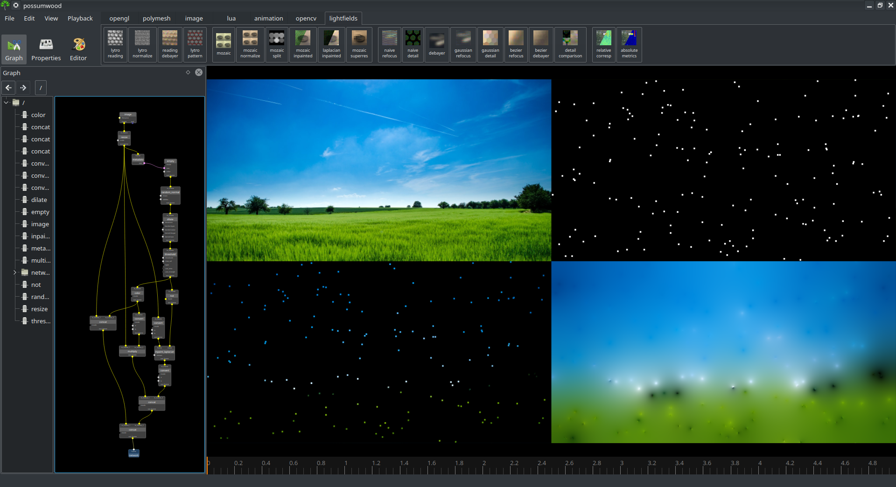
<div style="width:290px">&nbsp;&nbsp;&nbsp;&nbsp;&nbsp;&nbsp;&nbsp;&nbsp;&nbsp;&nbsp;&nbsp;&nbsp;&nbsp;</div> 
</td>
</tr> 
</table> 

### Hdr
<table> 
<tr> 
<td>
<div style="width:290px">&nbsp;&nbsp;&nbsp;&nbsp;&nbsp;&nbsp;&nbsp;&nbsp;&nbsp;&nbsp;&nbsp;&nbsp;&nbsp;</div> 

<div style="width:290px">&nbsp;&nbsp;&nbsp;&nbsp;&nbsp;&nbsp;&nbsp;&nbsp;&nbsp;&nbsp;&nbsp;&nbsp;&nbsp;</div> 
</td>
<td> 

#### HDR merge using Mertens algorithm

Multi-exposure merge is an procedure in high dynamic range imaging.

This setup merges 5 hand-held exposures of a scene to an HDR image using Mertens algorithm. As the inputs are not perfectly aligned, the output shows "ghosting" artifacts, as expected in this type of setup.

<sub>Mertens, Tom, Jan Kautz, and Frank Van Reeth. ["Exposure fusion."](http://cholla.mmto.org/minerals/macro/exposure_fusion_reduced.pdf) 15th Pacific Conference on Computer Graphics and Applications (PG'07). IEEE, 2007.</sub>
</td> 
<td>
<div style="width:290px">&nbsp;&nbsp;&nbsp;&nbsp;&nbsp;&nbsp;&nbsp;&nbsp;&nbsp;&nbsp;&nbsp;&nbsp;&nbsp;</div> 

<div style="width:290px">&nbsp;&nbsp;&nbsp;&nbsp;&nbsp;&nbsp;&nbsp;&nbsp;&nbsp;&nbsp;&nbsp;&nbsp;&nbsp;</div> 
</td>
</tr> 
<tr> 
<td>
<div style="width:290px">&nbsp;&nbsp;&nbsp;&nbsp;&nbsp;&nbsp;&nbsp;&nbsp;&nbsp;&nbsp;&nbsp;&nbsp;&nbsp;</div> 

<div style="width:290px">&nbsp;&nbsp;&nbsp;&nbsp;&nbsp;&nbsp;&nbsp;&nbsp;&nbsp;&nbsp;&nbsp;&nbsp;&nbsp;</div> 
</td>
<td> 

#### Aligned HDR merge using Mertens algorithm

For a HDR merge algorithm to correctly process its inputs, the input images need to be precisely aligned. This can be either achived by careful capture, via a calibration and alignment step, or by a simpler image-alignment algorithm.

This demo shows how a simple alignment of hand-held multiple exposures can be achieved using the `MTB` algorithm, without the need of complex calibration. The resulting images are then merged to a HDR image using Mertens algorithm, completely eliminating the ghosting artifacts from the unaligned version of this demo.

<sub>Mertens, Tom, Jan Kautz, and Frank Van Reeth. ["Exposure fusion."](http://cholla.mmto.org/minerals/macro/exposure_fusion_reduced.pdf) 15th Pacific Conference on Computer Graphics and Applications (PG'07). IEEE, 2007.</sub>

<sub>Ward, Greg. ["Fast, robust image registration for compositing high dynamic range photographs from hand-held exposures."](http://pages.cs.wisc.edu/~lizhang/courses/cs766-2008f/projects/hdr/jgtpap2.pdf) Journal of graphics tools 8.2 (2003): 17-30.</sub>
</td> 
<td>
<div style="width:290px">&nbsp;&nbsp;&nbsp;&nbsp;&nbsp;&nbsp;&nbsp;&nbsp;&nbsp;&nbsp;&nbsp;&nbsp;&nbsp;</div> 

<div style="width:290px">&nbsp;&nbsp;&nbsp;&nbsp;&nbsp;&nbsp;&nbsp;&nbsp;&nbsp;&nbsp;&nbsp;&nbsp;&nbsp;</div> 
</td>
</tr> 
<tr> 
<td>
<div style="width:290px">&nbsp;&nbsp;&nbsp;&nbsp;&nbsp;&nbsp;&nbsp;&nbsp;&nbsp;&nbsp;&nbsp;&nbsp;&nbsp;</div> 

<div style="width:290px">&nbsp;&nbsp;&nbsp;&nbsp;&nbsp;&nbsp;&nbsp;&nbsp;&nbsp;&nbsp;&nbsp;&nbsp;&nbsp;</div> 
</td>
<td> 

#### Aligned HDR merge using Debevec algorithm with response curve estimation

When merging multiple exposures for HDR imaging, it is often beneficial to use raw image data, avoiding any processing and gamma correction a camera might do to produce a perceptually good looking result. In some cases, when using cheaper cameras or a mobile phone, it might not be possible to use raw data, which means that an additional calibration step is required.

This setup shows how to use EXIF data from a set of JPG images to estimate the camera response curve using Debevec's algorithm, and then use the resulting curve for a more accurate HDR merge using Debevec's HDR merge algorithm. Compared to previous demos using Merten's algorithm, the dynamic range of the resulting image is much wider, with a more accurate representation of luminance information present in the scene.

<sub>Debevec, Paul E., and Jitendra Malik. ["Recovering high dynamic range radiance maps from photographs."](http://citeseerx.ist.psu.edu/viewdoc/download?doi=10.1.1.463.6496&rep=rep1&type=pdf) ACM SIGGRAPH 2008 classes. ACM, 2008.</sub>
</td> 
<td>
<div style="width:290px">&nbsp;&nbsp;&nbsp;&nbsp;&nbsp;&nbsp;&nbsp;&nbsp;&nbsp;&nbsp;&nbsp;&nbsp;&nbsp;</div> 

<div style="width:290px">&nbsp;&nbsp;&nbsp;&nbsp;&nbsp;&nbsp;&nbsp;&nbsp;&nbsp;&nbsp;&nbsp;&nbsp;&nbsp;</div> 
</td>
</tr> 
<tr> 
<td>
<div style="width:290px">&nbsp;&nbsp;&nbsp;&nbsp;&nbsp;&nbsp;&nbsp;&nbsp;&nbsp;&nbsp;&nbsp;&nbsp;&nbsp;</div> 

<div style="width:290px">&nbsp;&nbsp;&nbsp;&nbsp;&nbsp;&nbsp;&nbsp;&nbsp;&nbsp;&nbsp;&nbsp;&nbsp;&nbsp;</div> 
</td>
<td> 

#### Drago tonemapping

Tonemapping is the process of converting High Dynamic Range content to a standard display. The simplest operators are global (such as [Gamma correction](https://en.wikipedia.org/wiki/Gamma_correction), while others act adaptively, mimicking the behaviour of human visual system.

This demo shows how to set up Drago's tonemapping algorithm in Possumwood.

<sub>Drago, Fr&#233;d&#233;ric, et al. ["Adaptive logarithmic mapping for displaying high contrast scenes."](http://citeseerx.ist.psu.edu/viewdoc/download?doi=10.1.1.69.8094&rep=rep1&type=pdf) Computer graphics forum. Vol. 22. No. 3. Oxford, UK: Blackwell Publishing, Inc, 2003.<sub>

</td> 
<td>
<div style="width:290px">&nbsp;&nbsp;&nbsp;&nbsp;&nbsp;&nbsp;&nbsp;&nbsp;&nbsp;&nbsp;&nbsp;&nbsp;&nbsp;</div> 
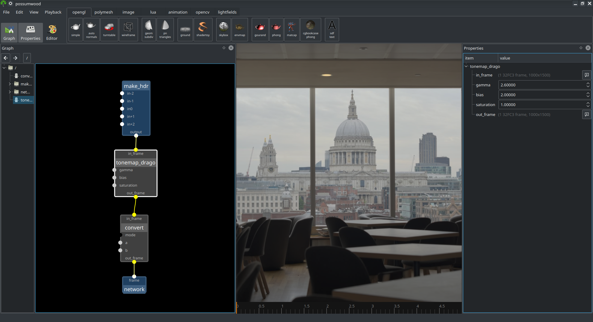
<div style="width:290px">&nbsp;&nbsp;&nbsp;&nbsp;&nbsp;&nbsp;&nbsp;&nbsp;&nbsp;&nbsp;&nbsp;&nbsp;&nbsp;</div> 
</td>
</tr> 
<tr> 
<td>
<div style="width:290px">&nbsp;&nbsp;&nbsp;&nbsp;&nbsp;&nbsp;&nbsp;&nbsp;&nbsp;&nbsp;&nbsp;&nbsp;&nbsp;</div> 

<div style="width:290px">&nbsp;&nbsp;&nbsp;&nbsp;&nbsp;&nbsp;&nbsp;&nbsp;&nbsp;&nbsp;&nbsp;&nbsp;&nbsp;</div> 
</td>
<td> 

#### Reinhard's tonemapping

Tonemapping is the process of converting High Dynamic Range content to a standard display. The simplest operators are global (such as [Gamma correction](https://en.wikipedia.org/wiki/Gamma_correction), while others act adaptively, mimicking the behaviour of human visual system.

This demo shows how to set up Reinhards's tonemapping algorithm in Possumwood.

<sub>Reinhard, Erik, and Kate Devlin. ["Dynamic range reduction inspired by photoreceptor physiology."](http://pages.cs.wisc.edu/~lizhang/courses/cs766-2008f/projects/hdr/Reinhard2005DRR.pdf) IEEE transactions on visualization and computer graphics 11.1 (2005): 13-24.</sub>
</td> 
<td>
<div style="width:290px">&nbsp;&nbsp;&nbsp;&nbsp;&nbsp;&nbsp;&nbsp;&nbsp;&nbsp;&nbsp;&nbsp;&nbsp;&nbsp;</div> 

<div style="width:290px">&nbsp;&nbsp;&nbsp;&nbsp;&nbsp;&nbsp;&nbsp;&nbsp;&nbsp;&nbsp;&nbsp;&nbsp;&nbsp;</div> 
</td>
</tr> 
<tr> 
<td>
<div style="width:290px">&nbsp;&nbsp;&nbsp;&nbsp;&nbsp;&nbsp;&nbsp;&nbsp;&nbsp;&nbsp;&nbsp;&nbsp;&nbsp;</div> 

<div style="width:290px">&nbsp;&nbsp;&nbsp;&nbsp;&nbsp;&nbsp;&nbsp;&nbsp;&nbsp;&nbsp;&nbsp;&nbsp;&nbsp;</div> 
</td>
<td> 

#### Mantiuk tonemapping

Tonemapping is the process of converting High Dynamic Range content to a standard display. The simplest operators are global (such as [Gamma correction](https://en.wikipedia.org/wiki/Gamma_correction), while others act adaptively, mimicking the behaviour of human visual system.

This demo shows how to set up Mantiuk's tonemapping algorithm in Possumwood.

<sub>Mantiuk, Rafal, Karol Myszkowski, and Hans-Peter Seidel. ["A perceptual framework for contrast processing of high dynamic range images."](http://domino.mpi-inf.mpg.de/intranet/ag4/ag4publ.nsf/3561a79a83e6557ac1256b91004f4bdd/43fc98f7a2fc192ec1257149002e3b9a/$file/mantiuk06contrastproctap.pdf) ACM Transactions on Applied Perception (TAP) 3.3 (2006): 286-308.<sub>
</td> 
<td>
<div style="width:290px">&nbsp;&nbsp;&nbsp;&nbsp;&nbsp;&nbsp;&nbsp;&nbsp;&nbsp;&nbsp;&nbsp;&nbsp;&nbsp;</div> 

<div style="width:290px">&nbsp;&nbsp;&nbsp;&nbsp;&nbsp;&nbsp;&nbsp;&nbsp;&nbsp;&nbsp;&nbsp;&nbsp;&nbsp;</div> 
</td>
</tr> 
</table> 

### Lightfields
<table> 
<tr> 
<td>
<div style="width:290px">&nbsp;&nbsp;&nbsp;&nbsp;&nbsp;&nbsp;&nbsp;&nbsp;&nbsp;&nbsp;&nbsp;&nbsp;&nbsp;</div> 

<div style="width:290px">&nbsp;&nbsp;&nbsp;&nbsp;&nbsp;&nbsp;&nbsp;&nbsp;&nbsp;&nbsp;&nbsp;&nbsp;&nbsp;</div> 
</td>
<td> 

#### Lytro RAW lightfields reader

Lytro cameras output a proprietary raw image format, which has never been officially documented. However, it has been reverse-engineered, and the results were [documented in detail](http://optics.miloush.net/lytro/TheFileFormat.aspx) by [Jan Ku&#269;era](http://optics.miloush.net).

This demo implements a reader for Lytro RAW files, extracting both image data and metadata of each image.

<sub>Ku&#269;era, Jan. [Lytro Meltdown - the file format](http://optics.miloush.net/lytro/TheFileFormat.aspx).</sub>

<sub>Ku&#269;era, Jan. ["V&#253;po&#269;etn&#237; fotografie ve sv&#283;teln&#233;m poli a aplikace na panoramatick&#233; sn&#237;mky."](https://dspace.cuni.cz/bitstream/handle/20.500.11956/72092/DPTX_2012_1_11320_0_324872_0_132845.pdf?sequence=1) (2014).</sub>

<sub>Georgiev, Todor, et al. ["Lytro camera technology: theory, algorithms, performance analysis."](http://citeseerx.ist.psu.edu/viewdoc/download?doi=10.1.1.679.5441&rep=rep1&type=pdf) Multimedia Content and Mobile Devices. Vol. 8667. International Society for Optics and Photonics, 2013.</sub>


</td> 
<td>
<div style="width:290px">&nbsp;&nbsp;&nbsp;&nbsp;&nbsp;&nbsp;&nbsp;&nbsp;&nbsp;&nbsp;&nbsp;&nbsp;&nbsp;</div> 

<div style="width:290px">&nbsp;&nbsp;&nbsp;&nbsp;&nbsp;&nbsp;&nbsp;&nbsp;&nbsp;&nbsp;&nbsp;&nbsp;&nbsp;</div> 
</td>
</tr> 
<tr> 
<td>
<div style="width:290px">&nbsp;&nbsp;&nbsp;&nbsp;&nbsp;&nbsp;&nbsp;&nbsp;&nbsp;&nbsp;&nbsp;&nbsp;&nbsp;</div> 

<div style="width:290px">&nbsp;&nbsp;&nbsp;&nbsp;&nbsp;&nbsp;&nbsp;&nbsp;&nbsp;&nbsp;&nbsp;&nbsp;&nbsp;</div> 
</td>
<td> 

#### Lytro light field normalisation

Calibration of lightfield cameras is a complex process. One of the main issue facing microlens-based cameras is vignetting, caused both by the main lens, and by each of the microlenses.

A naive approach to address vignetting is by simply dividing the image pixels by the values of a white diffuse image captured with the same settings. While this approach addresses vignetting sufficiently, it doesn't take into account the camera response curve, leading to some artifacts still being present in the final image.

Georgiev, Todor, et al. ["Lytro camera technology: theory, algorithms, performance analysis."](http://citeseerx.ist.psu.edu/viewdoc/download?doi=10.1.1.679.5441&rep=rep1&type=pdf) Multimedia Content and Mobile Devices. Vol. 8667. International Society for Optics and Photonics, 2013.
</td> 
<td>
<div style="width:290px">&nbsp;&nbsp;&nbsp;&nbsp;&nbsp;&nbsp;&nbsp;&nbsp;&nbsp;&nbsp;&nbsp;&nbsp;&nbsp;</div> 

<div style="width:290px">&nbsp;&nbsp;&nbsp;&nbsp;&nbsp;&nbsp;&nbsp;&nbsp;&nbsp;&nbsp;&nbsp;&nbsp;&nbsp;</div> 
</td>
</tr> 
<tr> 
<td>
<div style="width:290px">&nbsp;&nbsp;&nbsp;&nbsp;&nbsp;&nbsp;&nbsp;&nbsp;&nbsp;&nbsp;&nbsp;&nbsp;&nbsp;</div> 

<div style="width:290px">&nbsp;&nbsp;&nbsp;&nbsp;&nbsp;&nbsp;&nbsp;&nbsp;&nbsp;&nbsp;&nbsp;&nbsp;&nbsp;</div> 
</td>
<td> 

#### Lytro lightfields debayern

The sensor of Lytro cameras are conventional Bayer-pattern color filters. In standard photography, one of the first steps of image processing involves the interpolation of values of neighbouring pixels to remove the Bayer pattern.

This demo shows how to obtain a debayered normalised lightfield in Possumwood.

<sub>Kucera, J. "Computational photography of light-field camera and application to panoramic photography." Institute of Information Theory and Automation (2014).</sub>
</td> 
<td>
<div style="width:290px">&nbsp;&nbsp;&nbsp;&nbsp;&nbsp;&nbsp;&nbsp;&nbsp;&nbsp;&nbsp;&nbsp;&nbsp;&nbsp;</div> 

<div style="width:290px">&nbsp;&nbsp;&nbsp;&nbsp;&nbsp;&nbsp;&nbsp;&nbsp;&nbsp;&nbsp;&nbsp;&nbsp;&nbsp;</div> 
</td>
</tr> 
<tr> 
<td>
<div style="width:290px">&nbsp;&nbsp;&nbsp;&nbsp;&nbsp;&nbsp;&nbsp;&nbsp;&nbsp;&nbsp;&nbsp;&nbsp;&nbsp;</div> 

<div style="width:290px">&nbsp;&nbsp;&nbsp;&nbsp;&nbsp;&nbsp;&nbsp;&nbsp;&nbsp;&nbsp;&nbsp;&nbsp;&nbsp;</div> 
</td>
<td> 

#### Lytro microlens pattern reconstruction

Reconstruction of the microlens pattern is essential for recovering the lightfield data from a Lytro image.

This demo shows how the information embedded in the metadata of a Lytro raw image can be used to reconstruct the microlens array, and visualise the result.

Georgiev, Todor, et al. ["Lytro camera technology: theory, algorithms, performance analysis."](http://citeseerx.ist.psu.edu/viewdoc/download?doi=10.1.1.679.5441&rep=rep1&type=pdf) Multimedia Content and Mobile Devices. Vol. 8667. International Society for Optics and Photonics, 2013.
</td> 
<td>
<div style="width:290px">&nbsp;&nbsp;&nbsp;&nbsp;&nbsp;&nbsp;&nbsp;&nbsp;&nbsp;&nbsp;&nbsp;&nbsp;&nbsp;</div> 

<div style="width:290px">&nbsp;&nbsp;&nbsp;&nbsp;&nbsp;&nbsp;&nbsp;&nbsp;&nbsp;&nbsp;&nbsp;&nbsp;&nbsp;</div> 
</td>
</tr> 
<tr> 
<td>
<div style="width:290px">&nbsp;&nbsp;&nbsp;&nbsp;&nbsp;&nbsp;&nbsp;&nbsp;&nbsp;&nbsp;&nbsp;&nbsp;&nbsp;</div> 
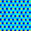
<div style="width:290px">&nbsp;&nbsp;&nbsp;&nbsp;&nbsp;&nbsp;&nbsp;&nbsp;&nbsp;&nbsp;&nbsp;&nbsp;&nbsp;</div> 
</td>
<td> 

#### Lytro pattern detection

Lytro files come with metadata that descibe the parameters of the lenslet pattern used to capture the image. Unfortunately, this lenslet pattern was detected using a simple peak-detection algorithm, with together with the main-lens vignetting causes the lenslet centers to be slightly biased towards the centre of the image.

This demo attempt to detect the lenslets using a different method - by inverting the image, locally normalising it and convoluting it with an inverted lenslet pattern (a "hexagonal" shape representing the darker spaces between lenslets), we can achieve a better match with the original lenslet placement.

This demo only shows the image-processing part - the pattern fitting is demonstrated in the next demo.
</td> 
<td>
<div style="width:290px">&nbsp;&nbsp;&nbsp;&nbsp;&nbsp;&nbsp;&nbsp;&nbsp;&nbsp;&nbsp;&nbsp;&nbsp;&nbsp;</div> 

<div style="width:290px">&nbsp;&nbsp;&nbsp;&nbsp;&nbsp;&nbsp;&nbsp;&nbsp;&nbsp;&nbsp;&nbsp;&nbsp;&nbsp;</div> 
</td>
</tr> 
<tr> 
<td>
<div style="width:290px">&nbsp;&nbsp;&nbsp;&nbsp;&nbsp;&nbsp;&nbsp;&nbsp;&nbsp;&nbsp;&nbsp;&nbsp;&nbsp;</div> 
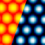
<div style="width:290px">&nbsp;&nbsp;&nbsp;&nbsp;&nbsp;&nbsp;&nbsp;&nbsp;&nbsp;&nbsp;&nbsp;&nbsp;&nbsp;</div> 
</td>
<td> 

#### Lytro pattern fitting

This demo implements fitting of lenslet data detected using a convolution-based setup described in the previous demo.

Display allows to preview both the original pattern, and the new detected pattern - just change the "blend" parameter.
</td> 
<td>
<div style="width:290px">&nbsp;&nbsp;&nbsp;&nbsp;&nbsp;&nbsp;&nbsp;&nbsp;&nbsp;&nbsp;&nbsp;&nbsp;&nbsp;</div> 

<div style="width:290px">&nbsp;&nbsp;&nbsp;&nbsp;&nbsp;&nbsp;&nbsp;&nbsp;&nbsp;&nbsp;&nbsp;&nbsp;&nbsp;</div> 
</td>
</tr> 
<tr> 
<td>
<div style="width:290px">&nbsp;&nbsp;&nbsp;&nbsp;&nbsp;&nbsp;&nbsp;&nbsp;&nbsp;&nbsp;&nbsp;&nbsp;&nbsp;</div> 

<div style="width:290px">&nbsp;&nbsp;&nbsp;&nbsp;&nbsp;&nbsp;&nbsp;&nbsp;&nbsp;&nbsp;&nbsp;&nbsp;&nbsp;</div> 
</td>
<td> 

#### Epipolar Images

Epipolar images show slices of the 4D lightfield along different axis. 

The x-y image (center) shows a slice corresponding to a single dept-of-field image. By changing the UV offset or interval, it is possible to create images with different depth of field or focal plane.

The u-x and v-y images (left, right, top and bottom) show slices with "line direction" (based on incoming direction of rays) corresponding to individual depth planes. 

<sub>Ng, Ren, et al. ["Light field photography with a hand-held plenoptic camera."](http://www2.ene.unb.br/mylene/PI/refs/lfcamera-150dpi.pdf) Computer Science Technical Report CSTR 2.11 (2005): 1-11.</sub>
</td> 
<td>
<div style="width:290px">&nbsp;&nbsp;&nbsp;&nbsp;&nbsp;&nbsp;&nbsp;&nbsp;&nbsp;&nbsp;&nbsp;&nbsp;&nbsp;</div> 

<div style="width:290px">&nbsp;&nbsp;&nbsp;&nbsp;&nbsp;&nbsp;&nbsp;&nbsp;&nbsp;&nbsp;&nbsp;&nbsp;&nbsp;</div> 
</td>
</tr> 
<tr> 
<td>
<div style="width:290px">&nbsp;&nbsp;&nbsp;&nbsp;&nbsp;&nbsp;&nbsp;&nbsp;&nbsp;&nbsp;&nbsp;&nbsp;&nbsp;</div> 

<div style="width:290px">&nbsp;&nbsp;&nbsp;&nbsp;&nbsp;&nbsp;&nbsp;&nbsp;&nbsp;&nbsp;&nbsp;&nbsp;&nbsp;</div> 
</td>
<td> 

#### UV EPIs

The epipolar images accumulated in UV space show images representing averages of lenslets in different part of the image. This provides a good measure for the quality of Lytro lenslet pattern detection and main lens calibration - if correct, all lenslets should look very similar.

<sub>Ng, Ren, et al. ["Light field photography with a hand-held plenoptic camera."](http://www2.ene.unb.br/mylene/PI/refs/lfcamera-150dpi.pdf) Computer Science Technical Report CSTR 2.11 (2005): 1-11.</sub>
</td> 
<td>
<div style="width:290px">&nbsp;&nbsp;&nbsp;&nbsp;&nbsp;&nbsp;&nbsp;&nbsp;&nbsp;&nbsp;&nbsp;&nbsp;&nbsp;</div> 

<div style="width:290px">&nbsp;&nbsp;&nbsp;&nbsp;&nbsp;&nbsp;&nbsp;&nbsp;&nbsp;&nbsp;&nbsp;&nbsp;&nbsp;</div> 
</td>
</tr> 
<tr> 
<td>
<div style="width:290px">&nbsp;&nbsp;&nbsp;&nbsp;&nbsp;&nbsp;&nbsp;&nbsp;&nbsp;&nbsp;&nbsp;&nbsp;&nbsp;</div> 

<div style="width:290px">&nbsp;&nbsp;&nbsp;&nbsp;&nbsp;&nbsp;&nbsp;&nbsp;&nbsp;&nbsp;&nbsp;&nbsp;&nbsp;</div> 
</td>
<td> 

#### Sub-aperture images from Lytro lightfields data

Lightfield data contain enough information to allow for reconstruction of multiple narrow-base sub-apreture images, each with slightly different "point of view".

This demo shows how to use demultiplexing to reconstruct multiple views from raw Lytro data.

<sub>Sabater, Neus, et al. ["Accurate disparity estimation for plenoptic images."](https://pdfs.semanticscholar.org/e79c/4371f7636d3c94c839d00653390e791e0e0b.pdf) European Conference on Computer Vision. Springer, Cham, 2014.</sub>
</td> 
<td>
<div style="width:290px">&nbsp;&nbsp;&nbsp;&nbsp;&nbsp;&nbsp;&nbsp;&nbsp;&nbsp;&nbsp;&nbsp;&nbsp;&nbsp;</div> 

<div style="width:290px">&nbsp;&nbsp;&nbsp;&nbsp;&nbsp;&nbsp;&nbsp;&nbsp;&nbsp;&nbsp;&nbsp;&nbsp;&nbsp;</div> 
</td>
</tr> 
<tr> 
<td>
<div style="width:290px">&nbsp;&nbsp;&nbsp;&nbsp;&nbsp;&nbsp;&nbsp;&nbsp;&nbsp;&nbsp;&nbsp;&nbsp;&nbsp;</div> 

<div style="width:290px">&nbsp;&nbsp;&nbsp;&nbsp;&nbsp;&nbsp;&nbsp;&nbsp;&nbsp;&nbsp;&nbsp;&nbsp;&nbsp;</div> 
</td>
<td> 

#### Normalized sub-aperture images from Lytro lightfields data

Lightfield data contain enough information to allow for reconstruction of multiple narrow-base sub-apreture images, each with slightly different "point of view".

This demo shows how to use demultiplexing to reconstruct multiple views from normalized raw Lytro data. Normalization is performed by simple division of the image data by white diffuse image values.

<sub>Sabater, Neus, et al. ["Accurate disparity estimation for plenoptic images."](https://pdfs.semanticscholar.org/e79c/4371f7636d3c94c839d00653390e791e0e0b.pdf) European Conference on Computer Vision. Springer, Cham, 2014.</sub>
</td> 
<td>
<div style="width:290px">&nbsp;&nbsp;&nbsp;&nbsp;&nbsp;&nbsp;&nbsp;&nbsp;&nbsp;&nbsp;&nbsp;&nbsp;&nbsp;</div> 

<div style="width:290px">&nbsp;&nbsp;&nbsp;&nbsp;&nbsp;&nbsp;&nbsp;&nbsp;&nbsp;&nbsp;&nbsp;&nbsp;&nbsp;</div> 
</td>
</tr> 
<tr> 
<td>
<div style="width:290px">&nbsp;&nbsp;&nbsp;&nbsp;&nbsp;&nbsp;&nbsp;&nbsp;&nbsp;&nbsp;&nbsp;&nbsp;&nbsp;</div> 

<div style="width:290px">&nbsp;&nbsp;&nbsp;&nbsp;&nbsp;&nbsp;&nbsp;&nbsp;&nbsp;&nbsp;&nbsp;&nbsp;&nbsp;</div> 
</td>
<td> 

#### Sub-apreture mosaic image sample counts

Demultiplexing a Bayern image leads to a significantly larger number of samples for green pixels, compared to red and blue values.

This demo addempts to visualise this difference explicitly, by showing both each channel of the demultiplexed image, and the number of samples used to reconstruct each of its pixels.
</td> 
<td>
<div style="width:290px">&nbsp;&nbsp;&nbsp;&nbsp;&nbsp;&nbsp;&nbsp;&nbsp;&nbsp;&nbsp;&nbsp;&nbsp;&nbsp;</div> 

<div style="width:290px">&nbsp;&nbsp;&nbsp;&nbsp;&nbsp;&nbsp;&nbsp;&nbsp;&nbsp;&nbsp;&nbsp;&nbsp;&nbsp;</div> 
</td>
</tr> 
<tr> 
<td>
<div style="width:290px">&nbsp;&nbsp;&nbsp;&nbsp;&nbsp;&nbsp;&nbsp;&nbsp;&nbsp;&nbsp;&nbsp;&nbsp;&nbsp;</div> 

<div style="width:290px">&nbsp;&nbsp;&nbsp;&nbsp;&nbsp;&nbsp;&nbsp;&nbsp;&nbsp;&nbsp;&nbsp;&nbsp;&nbsp;</div> 
</td>
<td> 

#### Sub-apreture image inpainting

To reconstruct missing data after obtaining sub-apreture images, this demo uses a simple inpainting technique from OpenCV to reconstruct missing data in each image separately.

<sub>Sabater, Neus, et al. ["Accurate disparity estimation for plenoptic images."](https://pdfs.semanticscholar.org/e79c/4371f7636d3c94c839d00653390e791e0e0b.pdf) European Conference on Computer Vision. Springer, Cham, 2014.</sub>

<sub>Bertalmio, Marcelo, Andrea L. Bertozzi, and Guillermo Sapiro. ["Navier-stokes, fluid dynamics, and image and video inpainting."](https://conservancy.umn.edu/bitstream/handle/11299/3607/1772.pdf?sequence=1) Proceedings of the 2001 IEEE Computer Society Conference on Computer Vision and Pattern Recognition. CVPR 2001. Vol. 1. IEEE, 2001.</sub>
</td> 
<td>
<div style="width:290px">&nbsp;&nbsp;&nbsp;&nbsp;&nbsp;&nbsp;&nbsp;&nbsp;&nbsp;&nbsp;&nbsp;&nbsp;&nbsp;</div> 

<div style="width:290px">&nbsp;&nbsp;&nbsp;&nbsp;&nbsp;&nbsp;&nbsp;&nbsp;&nbsp;&nbsp;&nbsp;&nbsp;&nbsp;</div> 
</td>
</tr> 
<tr> 
<td>
<div style="width:290px">&nbsp;&nbsp;&nbsp;&nbsp;&nbsp;&nbsp;&nbsp;&nbsp;&nbsp;&nbsp;&nbsp;&nbsp;&nbsp;</div> 

<div style="width:290px">&nbsp;&nbsp;&nbsp;&nbsp;&nbsp;&nbsp;&nbsp;&nbsp;&nbsp;&nbsp;&nbsp;&nbsp;&nbsp;</div> 
</td>
<td> 

#### Sub-apreture image inpainting using smoothness prior

To reconstruct missing data after obtaining sub-apreture images, this demo uses a simple Laplacian-based inpainting technique to reconstruct missing data in each image separately.

<sub>Sabater, Neus, et al. ["Accurate disparity estimation for plenoptic images."](https://pdfs.semanticscholar.org/e79c/4371f7636d3c94c839d00653390e791e0e0b.pdf) European Conference on Computer Vision. Springer, Cham, 2014.</sub>

<sub>Cohen-Or, Daniel, et al. [A sampler of useful computational tools for applied geometry, computer graphics, and image processing.](https://pdfs.semanticscholar.org/de0c/afb6c0775ed29b79a9d947b5174092581a4e.pdf) AK Peters/CRC Press, 2015.</sub>
</td> 
<td>
<div style="width:290px">&nbsp;&nbsp;&nbsp;&nbsp;&nbsp;&nbsp;&nbsp;&nbsp;&nbsp;&nbsp;&nbsp;&nbsp;&nbsp;</div> 

<div style="width:290px">&nbsp;&nbsp;&nbsp;&nbsp;&nbsp;&nbsp;&nbsp;&nbsp;&nbsp;&nbsp;&nbsp;&nbsp;&nbsp;</div> 
</td>
</tr> 
<tr> 
<td>
<div style="width:290px">&nbsp;&nbsp;&nbsp;&nbsp;&nbsp;&nbsp;&nbsp;&nbsp;&nbsp;&nbsp;&nbsp;&nbsp;&nbsp;</div> 

<div style="width:290px">&nbsp;&nbsp;&nbsp;&nbsp;&nbsp;&nbsp;&nbsp;&nbsp;&nbsp;&nbsp;&nbsp;&nbsp;&nbsp;</div> 
</td>
<td> 

#### Mosaic-based lightfields superresolution

Reconstructed mosaic data can be used to reconstruct a high-resolution image using a simple multiplexing algorithm.

This demo shows the result of this algorithm on an inpainted mosaic from previous demos.
</td> 
<td>
<div style="width:290px">&nbsp;&nbsp;&nbsp;&nbsp;&nbsp;&nbsp;&nbsp;&nbsp;&nbsp;&nbsp;&nbsp;&nbsp;&nbsp;</div> 

<div style="width:290px">&nbsp;&nbsp;&nbsp;&nbsp;&nbsp;&nbsp;&nbsp;&nbsp;&nbsp;&nbsp;&nbsp;&nbsp;&nbsp;</div> 
</td>
</tr> 
<tr> 
<td>
<div style="width:290px">&nbsp;&nbsp;&nbsp;&nbsp;&nbsp;&nbsp;&nbsp;&nbsp;&nbsp;&nbsp;&nbsp;&nbsp;&nbsp;</div> 

<div style="width:290px">&nbsp;&nbsp;&nbsp;&nbsp;&nbsp;&nbsp;&nbsp;&nbsp;&nbsp;&nbsp;&nbsp;&nbsp;&nbsp;</div> 
</td>
<td> 

#### Naive refocusing

The simplest method of lightfields digital refocusing is to directly use the lightfield's equation to determine the target pixel position for each sample, given its position in the lightfield image and its corresponding `u` and `v` values.

While very simple and fast, the number of samples for each pixel can vary depending on the bayern pattern and focal distance, often leading to noisy and/or low-resolution results with artifacts.

<sub>Ng, Ren, et al. ["Light field photography with a hand-held plenoptic camera."](http://www2.ene.unb.br/mylene/PI/refs/lfcamera-150dpi.pdf) Computer Science Technical Report CSTR 2.11 (2005): 1-11.</sub>
</td> 
<td>
<div style="width:290px">&nbsp;&nbsp;&nbsp;&nbsp;&nbsp;&nbsp;&nbsp;&nbsp;&nbsp;&nbsp;&nbsp;&nbsp;&nbsp;</div> 

<div style="width:290px">&nbsp;&nbsp;&nbsp;&nbsp;&nbsp;&nbsp;&nbsp;&nbsp;&nbsp;&nbsp;&nbsp;&nbsp;&nbsp;</div> 
</td>
</tr> 
<tr> 
<td>
<div style="width:290px">&nbsp;&nbsp;&nbsp;&nbsp;&nbsp;&nbsp;&nbsp;&nbsp;&nbsp;&nbsp;&nbsp;&nbsp;&nbsp;</div> 
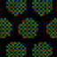
<div style="width:290px">&nbsp;&nbsp;&nbsp;&nbsp;&nbsp;&nbsp;&nbsp;&nbsp;&nbsp;&nbsp;&nbsp;&nbsp;&nbsp;</div> 
</td>
<td> 

#### Naive refocusing detail

This demo shows the detail of the sampling and integration pattern of previous demo.

<sub>Ng, Ren, et al. ["Light field photography with a hand-held plenoptic camera."](http://www2.ene.unb.br/mylene/PI/refs/lfcamera-150dpi.pdf) Computer Science Technical Report CSTR 2.11 (2005): 1-11.</sub>
</td> 
<td>
<div style="width:290px">&nbsp;&nbsp;&nbsp;&nbsp;&nbsp;&nbsp;&nbsp;&nbsp;&nbsp;&nbsp;&nbsp;&nbsp;&nbsp;</div> 

<div style="width:290px">&nbsp;&nbsp;&nbsp;&nbsp;&nbsp;&nbsp;&nbsp;&nbsp;&nbsp;&nbsp;&nbsp;&nbsp;&nbsp;</div> 
</td>
</tr> 
<tr> 
<td>
<div style="width:290px">&nbsp;&nbsp;&nbsp;&nbsp;&nbsp;&nbsp;&nbsp;&nbsp;&nbsp;&nbsp;&nbsp;&nbsp;&nbsp;</div> 

<div style="width:290px">&nbsp;&nbsp;&nbsp;&nbsp;&nbsp;&nbsp;&nbsp;&nbsp;&nbsp;&nbsp;&nbsp;&nbsp;&nbsp;</div> 
</td>
<td> 

#### Naive refocusing with a de-bayern filter

Applying a de-Bayer filter to raw lightfield data reduces some artifacts seen in previous two demos.

<sub>Ng, Ren, et al. ["Light field photography with a hand-held plenoptic camera."](http://www2.ene.unb.br/mylene/PI/refs/lfcamera-150dpi.pdf) Computer Science Technical Report CSTR 2.11 (2005): 1-11.</sub>
</td> 
<td>
<div style="width:290px">&nbsp;&nbsp;&nbsp;&nbsp;&nbsp;&nbsp;&nbsp;&nbsp;&nbsp;&nbsp;&nbsp;&nbsp;&nbsp;</div> 

<div style="width:290px">&nbsp;&nbsp;&nbsp;&nbsp;&nbsp;&nbsp;&nbsp;&nbsp;&nbsp;&nbsp;&nbsp;&nbsp;&nbsp;</div> 
</td>
</tr> 
<tr> 
<td>
<div style="width:290px">&nbsp;&nbsp;&nbsp;&nbsp;&nbsp;&nbsp;&nbsp;&nbsp;&nbsp;&nbsp;&nbsp;&nbsp;&nbsp;</div> 

<div style="width:290px">&nbsp;&nbsp;&nbsp;&nbsp;&nbsp;&nbsp;&nbsp;&nbsp;&nbsp;&nbsp;&nbsp;&nbsp;&nbsp;</div> 
</td>
<td> 

#### Refocusing with radial-basis function regression

To reduce the gaps in refocused images caused by missing samples, and to exploit the information in samples that would otherwise be averaged-out into a single pixel, it is possible to use a radial-basis function regression superresolution framework.

This demo shows how a simple gaussian-based accumulation, similar to one used for mult-frame supersampling on modern phones, can be used to improve the resolution and quality of a super-sampled refocused image.

<sub>Ng, Ren, et al. ["Light field photography with a hand-held plenoptic camera."](http://www2.ene.unb.br/mylene/PI/refs/lfcamera-150dpi.pdf) Computer Science Technical Report CSTR 2.11 (2005): 1-11.</sub>

<sub>Bartlomiej Wronski, Ignacio Garcia-Dorado, Manfred Ernst, Damien Kelly, Michael Krainin, Chia-Kai Liang, Marc Levoy, and Peyman Milanfar. 2019. [Handheld multi-frame super-resolution.](https://drive.google.com/file/d/1T1u2Mhm8ay6reHHouM1wO0TegvRJbJV_/view?usp=sharing) ACM Trans. Graph. 38, 4, Article 28 (July 2019), 18 pages. </sub>

<sub>Fiss, Juliet, Brian Curless, and Richard Szeliski. "Refocusing plenoptic images using depth-adaptive splatting." 2014 IEEE international conference on computational photography (ICCP). IEEE, 2014.</sub>
</td> 
<td>
<div style="width:290px">&nbsp;&nbsp;&nbsp;&nbsp;&nbsp;&nbsp;&nbsp;&nbsp;&nbsp;&nbsp;&nbsp;&nbsp;&nbsp;</div> 

<div style="width:290px">&nbsp;&nbsp;&nbsp;&nbsp;&nbsp;&nbsp;&nbsp;&nbsp;&nbsp;&nbsp;&nbsp;&nbsp;&nbsp;</div> 
</td>
</tr> 
<tr> 
<td>
<div style="width:290px">&nbsp;&nbsp;&nbsp;&nbsp;&nbsp;&nbsp;&nbsp;&nbsp;&nbsp;&nbsp;&nbsp;&nbsp;&nbsp;</div> 

<div style="width:290px">&nbsp;&nbsp;&nbsp;&nbsp;&nbsp;&nbsp;&nbsp;&nbsp;&nbsp;&nbsp;&nbsp;&nbsp;&nbsp;</div> 
</td>
<td> 

#### Refocussing with radial-basis function regression - detail

This demo shows the detail of the sampling and integration pattern of previous demo.


</td> 
<td>
<div style="width:290px">&nbsp;&nbsp;&nbsp;&nbsp;&nbsp;&nbsp;&nbsp;&nbsp;&nbsp;&nbsp;&nbsp;&nbsp;&nbsp;</div> 

<div style="width:290px">&nbsp;&nbsp;&nbsp;&nbsp;&nbsp;&nbsp;&nbsp;&nbsp;&nbsp;&nbsp;&nbsp;&nbsp;&nbsp;</div> 
</td>
</tr> 
<tr> 
<td>
<div style="width:290px">&nbsp;&nbsp;&nbsp;&nbsp;&nbsp;&nbsp;&nbsp;&nbsp;&nbsp;&nbsp;&nbsp;&nbsp;&nbsp;</div> 

<div style="width:290px">&nbsp;&nbsp;&nbsp;&nbsp;&nbsp;&nbsp;&nbsp;&nbsp;&nbsp;&nbsp;&nbsp;&nbsp;&nbsp;</div> 
</td>
<td> 

#### Refocussing with radial-basis function regression and a de-Bayer filter
Applying a de-Bayer filter to raw lightfield data reduces some artifacts seen in previous two demos, while introducing a level of additional colour ambiguity (i.e., a less sharp result).
</td> 
<td>
<div style="width:290px">&nbsp;&nbsp;&nbsp;&nbsp;&nbsp;&nbsp;&nbsp;&nbsp;&nbsp;&nbsp;&nbsp;&nbsp;&nbsp;</div> 
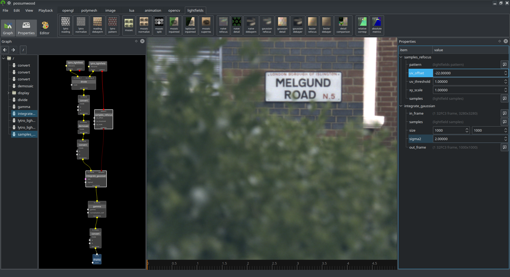
<div style="width:290px">&nbsp;&nbsp;&nbsp;&nbsp;&nbsp;&nbsp;&nbsp;&nbsp;&nbsp;&nbsp;&nbsp;&nbsp;&nbsp;</div> 
</td>
</tr> 
<tr> 
<td>
<div style="width:290px">&nbsp;&nbsp;&nbsp;&nbsp;&nbsp;&nbsp;&nbsp;&nbsp;&nbsp;&nbsp;&nbsp;&nbsp;&nbsp;</div> 

<div style="width:290px">&nbsp;&nbsp;&nbsp;&nbsp;&nbsp;&nbsp;&nbsp;&nbsp;&nbsp;&nbsp;&nbsp;&nbsp;&nbsp;</div> 
</td>
<td> 

#### Refocussing with hierarchical B-spline regression

Briand, Thibaud, and Pascal Monasse. ["Theory and Practice of Image B-Spline Interpolation."](https://www.ipol.im/pub/art/2018/221/article.pdf) Image Processing On Line 8 (2018): 99-141.
</td> 
<td>
<div style="width:290px">&nbsp;&nbsp;&nbsp;&nbsp;&nbsp;&nbsp;&nbsp;&nbsp;&nbsp;&nbsp;&nbsp;&nbsp;&nbsp;</div> 
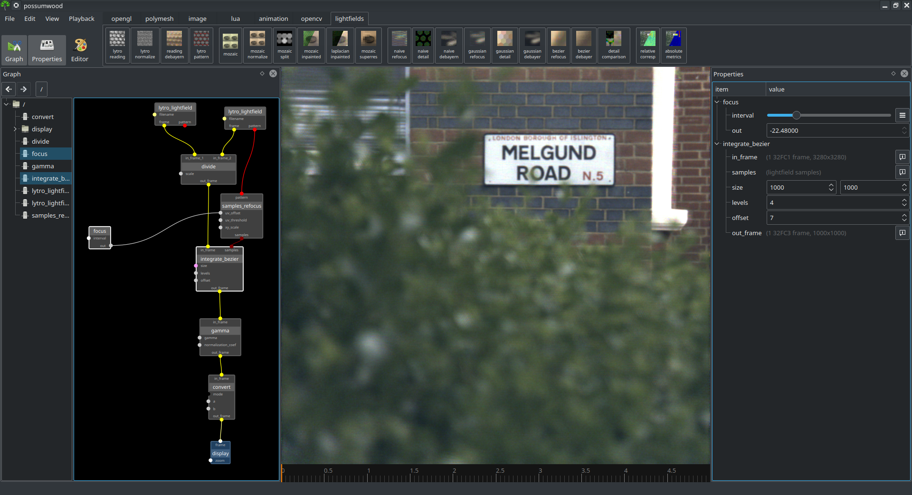
<div style="width:290px">&nbsp;&nbsp;&nbsp;&nbsp;&nbsp;&nbsp;&nbsp;&nbsp;&nbsp;&nbsp;&nbsp;&nbsp;&nbsp;</div> 
</td>
</tr> 
<tr> 
<td>
<div style="width:290px">&nbsp;&nbsp;&nbsp;&nbsp;&nbsp;&nbsp;&nbsp;&nbsp;&nbsp;&nbsp;&nbsp;&nbsp;&nbsp;</div> 

<div style="width:290px">&nbsp;&nbsp;&nbsp;&nbsp;&nbsp;&nbsp;&nbsp;&nbsp;&nbsp;&nbsp;&nbsp;&nbsp;&nbsp;</div> 
</td>
<td> 

#### Refocussing with hierarchical B-spline regression and de-bayern filter

Briand, Thibaud, and Pascal Monasse. ["Theory and Practice of Image B-Spline Interpolation."](https://www.ipol.im/pub/art/2018/221/article.pdf) Image Processing On Line 8 (2018): 99-141.
</td> 
<td>
<div style="width:290px">&nbsp;&nbsp;&nbsp;&nbsp;&nbsp;&nbsp;&nbsp;&nbsp;&nbsp;&nbsp;&nbsp;&nbsp;&nbsp;</div> 

<div style="width:290px">&nbsp;&nbsp;&nbsp;&nbsp;&nbsp;&nbsp;&nbsp;&nbsp;&nbsp;&nbsp;&nbsp;&nbsp;&nbsp;</div> 
</td>
</tr> 
<tr> 
<td>
<div style="width:290px">&nbsp;&nbsp;&nbsp;&nbsp;&nbsp;&nbsp;&nbsp;&nbsp;&nbsp;&nbsp;&nbsp;&nbsp;&nbsp;</div> 

<div style="width:290px">&nbsp;&nbsp;&nbsp;&nbsp;&nbsp;&nbsp;&nbsp;&nbsp;&nbsp;&nbsp;&nbsp;&nbsp;&nbsp;</div> 
</td>
<td> 

#### Comparison of details of different refocusing method

This demo shows the difference in integration patterns between different methods shown in previous demos.
</td> 
<td>
<div style="width:290px">&nbsp;&nbsp;&nbsp;&nbsp;&nbsp;&nbsp;&nbsp;&nbsp;&nbsp;&nbsp;&nbsp;&nbsp;&nbsp;</div> 
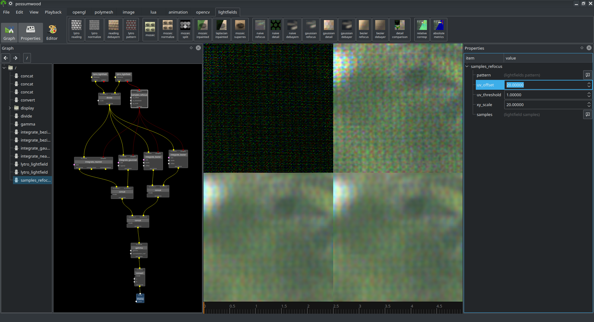
<div style="width:290px">&nbsp;&nbsp;&nbsp;&nbsp;&nbsp;&nbsp;&nbsp;&nbsp;&nbsp;&nbsp;&nbsp;&nbsp;&nbsp;</div> 
</td>
</tr> 
<tr> 
<td>
<div style="width:290px">&nbsp;&nbsp;&nbsp;&nbsp;&nbsp;&nbsp;&nbsp;&nbsp;&nbsp;&nbsp;&nbsp;&nbsp;&nbsp;</div> 

<div style="width:290px">&nbsp;&nbsp;&nbsp;&nbsp;&nbsp;&nbsp;&nbsp;&nbsp;&nbsp;&nbsp;&nbsp;&nbsp;&nbsp;</div> 
</td>
<td> 

#### Per-pixel correspondence metric (relative results)

Tao, Michael W., et al. ["Depth from combining defocus and correspondence using light-field cameras."](https://www.cv-foundation.org/openaccess/content_iccv_2013/papers/Tao_Depth_from_Combining_2013_ICCV_paper.pdf) Proceedings of the IEEE International Conference on Computer Vision. 2013.
</td> 
<td>
<div style="width:290px">&nbsp;&nbsp;&nbsp;&nbsp;&nbsp;&nbsp;&nbsp;&nbsp;&nbsp;&nbsp;&nbsp;&nbsp;&nbsp;</div> 

<div style="width:290px">&nbsp;&nbsp;&nbsp;&nbsp;&nbsp;&nbsp;&nbsp;&nbsp;&nbsp;&nbsp;&nbsp;&nbsp;&nbsp;</div> 
</td>
</tr> 
<tr> 
<td>
<div style="width:290px">&nbsp;&nbsp;&nbsp;&nbsp;&nbsp;&nbsp;&nbsp;&nbsp;&nbsp;&nbsp;&nbsp;&nbsp;&nbsp;</div> 

<div style="width:290px">&nbsp;&nbsp;&nbsp;&nbsp;&nbsp;&nbsp;&nbsp;&nbsp;&nbsp;&nbsp;&nbsp;&nbsp;&nbsp;</div> 
</td>
<td> 

#### Per-pixel correspondence and defocus metrics (absolute values)

Tao, Michael W., et al. ["Depth from combining defocus and correspondence using light-field cameras."](https://www.cv-foundation.org/openaccess/content_iccv_2013/papers/Tao_Depth_from_Combining_2013_ICCV_paper.pdf) Proceedings of the IEEE International Conference on Computer Vision. 2013.
</td> 
<td>
<div style="width:290px">&nbsp;&nbsp;&nbsp;&nbsp;&nbsp;&nbsp;&nbsp;&nbsp;&nbsp;&nbsp;&nbsp;&nbsp;&nbsp;</div> 

<div style="width:290px">&nbsp;&nbsp;&nbsp;&nbsp;&nbsp;&nbsp;&nbsp;&nbsp;&nbsp;&nbsp;&nbsp;&nbsp;&nbsp;</div> 
</td>
</tr> 
</table> 

## Tutorials

### Basics

Tutorials are intended to introduce the concepts in Possumwood, and help a user navigate its UIs. They are still work-in-progress, and more will be added over time.

#### [Lua integration](https://github.com/martin-pr/possumwood/wiki/Lua-Basics)

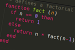

This tutorial introduces the [Lua](https://en.wikipedia.org/wiki/Lua_(programming_language)) integration of Possumwood, using a simple example of an addition node.

<div style="clear: both"></div>

### OpenGL / GLSL

#### [GLSL Turntable](https://github.com/martin-pr/possumwood/wiki/Basics-of-GLSL-in-Possumwood)


Introduces basic concepts of GLSL shaders in Possumwood, via a simple setup displaying a rotating car. Its model is loaded from an `.obj` file, converted to an OpenGL Vertex Buffer Object and displayed using a combination of a vertex and a fragment shader.

<div style="clear: both"></div>

#### [Skybox](https://github.com/martin-pr/possumwood/wiki/Skybox)

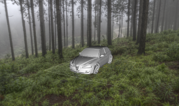

A simple GLSL skybox setup, using fragment shader and the `background` node (based on [gluUnProject](https://www.khronos.org/registry/OpenGL-Refpages)) to render a background quad with spherically-mapped texture.

<div style="clear: both"></div>

#### [Environment mapping](https://github.com/martin-pr/possumwood/wiki/Environment-mapping)


Environment map is a simple technique to approximate reflective surfaces in GLSL, without the need of actual raytracing. This tutorial builds on the previous Skybox tutorial, and extends it to make a teapot's material tool like polished metal.

<div style="clear: both"></div>

#### [Wireframe using a geometry shader](https://github.com/martin-pr/possumwood/wiki/Wireframe-using-a-Geometry-Shader)

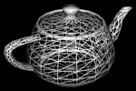

Most implementation of OpenGL 4 remove the ability to influence the width of lines using the classical `glLineWidth` call. This tutorial describes in detail how to achieve a similar effect (and much more) using a geometry shader, by rendering each line as a camera-facing polygon strip.

<div style="clear: both"></div>

#### [PN Triangles Tesselation using a geometry shader](https://github.com/martin-pr/possumwood/wiki/Geometry-Shader-Tessellation-using-PN-Triangles)

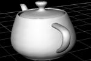

Implementation of [Curved PN Triangles](https://alex.vlachos.com/graphics/CurvedPNTriangles.pdf) tessellation technique, presented by Alex Vlachos on GDC 2011. This method tessellates input triangles using solely their vertex positions and normals (independently of the mesh topology) in a geometry shader.

<div style="clear: both"></div>

#### [Infinite Ground Plane using GLSL Shaders](https://github.com/martin-pr/possumwood/wiki/Infinite-ground-plane-using-GLSL-shaders)

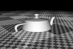

Infinite ground plane, implemented using a single polygon and simple fragment shader "raytracing" against a plane with _Y=0_.

<div style="clear: both"></div>

#### [Phong reflectance and shading models](https://github.com/martin-pr/possumwood/wiki/Phong-Lighting-Model)

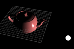

The [Phong reflectance model](https://en.wikipedia.org/wiki/Phong_reflection_model), and [Phong shading](https://en.wikipedia.org/wiki/Phong_shading) are two basic models of light behaviour in computer graphics. This tutorial explains their function, and provides a step-by-step implementation in GLSL, using a single orbiting light as the lightsource.

<div style="clear: both"></div>

### Image manipulation

#### [Image loading and display](https://github.com/martin-pr/possumwood/wiki/Images-Loading-and-Display)

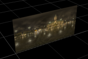

This tutorial introduces basic concepts of image manipulation in Possumwood, and a simple shader-based OpenGL setup to display a texture in the scene.

<div style="clear: both"></div>

#### [Image expressions](https://github.com/martin-pr/possumwood/wiki/Image-Generation-by-Expression)

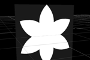

Apart from [rendering existing images loaded from a file](Images-Loading-and-Display), Possumwood can also generate and edit images using [Lua scripting](https://en.wikipedia.org/wiki/Lua_(programming_language)). In this tutorial, we explore a very simple setup which uses Lua and per-pixel expressions to generate an image.


## Installation

Possumwood has been tested only on Linux (several distributions). While it should work on Windows, it has not been compiled or tested there. No support for MacOS is planned for the time being due to heavy dependency on OpenGL.

### Launchpad PPA for Ubuntu 18.04+

On Ubuntu, the easiest way to install Possumwood is to use the [snapshots PPA](https://code.launchpad.net/~martin-prazak/+archive/ubuntu/possumwood), which is built against daily builds of common CGI libraries in the [cg-daily PPA](https://code.launchpad.net/~cgi-daily-devs/+archive/ubuntu/cgi-daily):

```
sudo add-apt-repository ppa:martin-prazak/possumwood
sudo add-apt-repository ppa:cgi-daily-devs/cgi-daily
sudo apt-get update
sudo apt-get install possumwood
```

This will install Possumwood to your system, enabling to simply run `possumwood` command from any terminal.

Daily build of Possumwood is built against a number of packages that are newer than most distros provide out of the box. These are contained in the [`ppa:martin-prazak/cgi-daily`](https://launchpad.net/~martin-prazak/+archive/ubuntu/cgi-daily) PPA. Some packages might conflict with the system versions (OpenImageIO, OpenCV), requiring the original system packages to be uninstalled first.

### Installation using Snap

Currently, Possumwood is released in [Snap](https://snapcraft.io/) as a development/testing package only. The latest build and its status can be accessed [here](https://build.snapcraft.io/user/martin-pr/possumwood).

To install a testing version, please run:

```
sudo snap install --edge possumwood --devmode
```

This will download and install the latest successful build of Possumwood with its dependencies. To start the application, run `possumwood` from the command line. As a dev build, snap will not automatically update this installation. Moreover, snap skin support is currently rather rudimentary, making Possumwood not inherit the system look correctly.

### Building from source

The project is structured as a standard CMake-built project. To build, just run these in the directory of the repository on any Linux distro:

```
mkdir build
cd build
cmake .. -DCMAKE_BUILD_TYPE=Release -DCMAKE_INSTALL_PREFIX=./install && make -j
```

This will build Possumwood and all its plugins, and install the result inside `./install` directory. Installation is necessary to make sure Possumwood is able to find its plugins and its dependencies. After that, you can run the build via:

```
./install/bin/possumwood
```


## Code Example

Possumwood is designed to be easily extensible. A simple addition node, using float attributes, can be implemented in a few lines of code:

```cpp
#include <possumwood_sdk/node_implementation.h>

namespace {

// strongly-typed attributes
dependency_graph::InAttr<float> input1, input2;
dependency_graph::OutAttr<float> output;

// main compute function
dependency_graph::State compute(dependency_graph::Values& data) {
	// maintains attribute types
	const float a = data.get(input1);
	const float b = data.get(input2);

	data.set(output, a + b);

	// empty status = no error (both dependency_graph::State and exceptions are supported)
	return dependency_graph::State();
}

void init(possumwood::Metadata& meta) {
	// attribute registration
	meta.addAttribute(input1, "a");
	meta.addAttribute(input2, "b");
	meta.addAttribute(output, "out");

	// attribute dependencies
	meta.addInfluence(input1, output);
	meta.addInfluence(input2, output);

	// and setting up a compute method
	meta.setCompute(compute);
}

// static registration of a new node type
possumwood::NodeImplementation s_impl("maths/add", init);

}
```

## API Reference

An auto-generated Doxygen reference can be found [here](https://martin-pr.github.io/possumwood/annotated.html)

## Contributors

Please feel free to contribute! I would welcome any form of feedback, opinions, bugs, code, or description of projects you are planning to use my code in!

At the moment, the project is in its **prototype stage**, and any feedback or help is welcome. In particular, it is in dire need of **a MS Windows build**, preferably using **AppVeyor**. Any help in that area would be greatly appreciated!

## License

The code is released under the [MIT license](https://en.wikipedia.org/wiki/MIT_License). Included example assets come with their own licenses, included in the directory of each asset.


