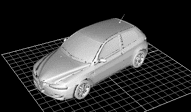

## Synopsis


Possumwood (named after [Sandbox Tree](https://en.wikipedia.org/wiki/Hura_crepitans)) is a **graph-based procedural sandbox**, implementing concepts of graph-based [visual programming](https://en.wikipedia.org/wiki/Visual_programming_language) in a simple interface. It is intended to provide a user-friendly and accessible UI for experimenting with common computer graphics algorithms and libraries (e.g., [CGAL](http://www.cgal.org/), [WildMagic](https://www.geometrictools.com/), [Eigen](http://eigen.tuxfamily.org/), [PhysBam](http://physbam.stanford.edu/)).

Possumwood is built on top of a simple graph-evaluation engine, and a Qt-based node graph editor, with an OpenGL viewport. Its main strength is its extensibility - it is trivial to implement new plugins supporting new libraries and data types, and allows free user-friendly experimentation with parameters of each algorithm.

**Possumwood is a sandbox, not a production tool.** As a sandbox, it is quite open to radical changes and redesign, and for the time being it does not guarantee any form backwards compatibility.

[](https://travis-ci.org/martin-pr/possumwood)

## Tutorials

Tutorials are intended to introduce the concepts in Possumwood, and help a user navigate its UIs. They are still work-in-progress, and more will be added over time.

### OpenGL / GLSL

#### [GLSL Turntable]()



Introduces basic concepts of GLSL shaders in Possumwood, via a simple setup displaying a rotating car. Its model is loaded from an `.obj` file, converted to an OpenGL Vertex Buffer Object and displayed using a combination of a vertex and a fragment shader.

<div style="clear: both"></div>

## Code Example

Possumwood is designed to be easily extensible. A simple addition node, using float attributes, can be implemented in a few lines of code:

```cpp
#include <possumwood_sdk/node_implementation.h>

namespace {

// strongly-typed attributes
dependency_graph::InAttr<float> input1, input2;
dependency_graph::OutAttr<float> output;

// main compute function
dependency_graph::State compute(dependency_graph::Values& data) {
	// maintains attribute types
	const float a = data.get(input1);
	const float b = data.get(input2);

	data.set(output, a + b);

	// empty status = no error (both dependency_graph::State and exceptions are supported)
	return dependency_graph::State();
}

void init(possumwood::Metadata& meta) {
	// attribute registration
	meta.addAttribute(input1, "a");
	meta.addAttribute(input2, "b");
	meta.addAttribute(output, "out");

	// attribute dependencies
	meta.addInfluence(input1, output);
	meta.addInfluence(input2, output);

	// and setting up a compute method
	meta.setCompute(compute);
}

// static registration of a new node type
possumwood::NodeImplementation s_impl("maths/add", init);

}
```

## Installation

The project is structured as a standard CMake-built project. To build, just run these in the directory of the repository on any Linux distro:

```
mkdir build
cd build
cmake .. && make -j
```

No installation targets are provided for the time being.

The code has been tested only on Linux (several distributions). While it should fundamentally work on Windows, it has not been compiled there. No support for MacOS is planned for the time being due to heavy dependency on OpenGL.

## API Reference

An auto-generated Doxygen reference can be found [here](https://martin-pr.github.io/possumwood/annotated.html)

## Contributors

Please feel free to contribute! I would welcome any form of feedback, opinions, bugs, code, or description of projects you are planning to use my code in!

At the moment, the project is in its **prototype stage**, and any feedback or help is welcome. In particular, it is in dire need of **a MS Windows build**, preferably using **AppVeyor**. Any help in that area would be greatly appreciated!

## License

The code is released under the [MIT license](https://en.wikipedia.org/wiki/MIT_License).
